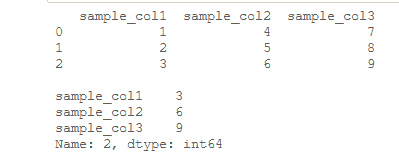

# 获取给定熊猫数据帧的指定行值

> 原文:[https://www . geeksforgeeks . org/get-给定熊猫的指定行值-dataframe/](https://www.geeksforgeeks.org/get-the-specified-row-value-of-a-given-pandas-dataframe/)

[**熊猫数据框**](https://www.geeksforgeeks.org/python-pandas-dataframe/) 是一个二维可变大小的、潜在异构的表格数据结构，带有标签轴(行和列)。

现在让我们看看如何获取给定数据帧的指定行值。

我们将使用数据框对象的 **loc[ ]、****【iloc】、**和 **[ ]** 从数据框中选择行和列。

1.  [**【iloc】**](https://www.geeksforgeeks.org/python-extracting-rows-using-pandas-iloc/)用于通过行/列对应的标签选择行/列。
2.  [**【loc】**](https://www.geeksforgeeks.org/python-pandas-dataframe-loc/)用于通过索引选择行/列。
3.  **[ ]** 用于按列的名称选择列。

**方法 1:** 使用 **iloc[ ]。**

**示例:**假设您有一个熊猫数据框，并且您想要根据其索引选择一个特定的行。

## 蟒蛇 3

```
# import pandas library
import pandas as pd

# Creating a dictionary
d = {'sample_col1': [1, 2, 3],
     'sample_col2': [4, 5, 6], 
     'sample_col3': [7, 8, 9]} 

# Creating a Dataframe
df = pd.DataFrame(d) 

# show the dataframe 
print(df) 

print()

# Select Row No. 2
print(df.iloc[2])
```

**输出:**



**方法 2:** 使用 **loc[ ]。**

**示例:**假设要选择给定列值的行。

## 蟒蛇 3

```
# import pandas library
import pandas as pd

# Creating a dictionary
d = {'sample_col1': [1, 2, 1],
     'sample_col2': [4, 5, 6], 
     'sample_col3': [7, 8, 9]} 

# Creating a Dataframe
df = pd.DataFrame(d) 

# show the dataframe
print(df) 

print()

# Select rows where sample_col1 is 1
print(df.loc[df['sample_col1'] == 1])
```