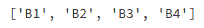
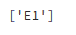
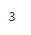

# 从熊猫数据框的一列中获取唯一值

> 原文:[https://www . geesforgeks . org/get-unique-values-from-in-column-pandas-data frame/](https://www.geeksforgeeks.org/get-unique-values-from-a-column-in-pandas-dataframe/)

让我们讨论如何从熊猫[数据框](https://www.geeksforgeeks.org/python-pandas-dataframe/)中的一列获取唯一值。

用列表字典创建一个简单的数据框架，比如列名为 **A、B、C、D、E** 的重复元素。
T3】

现在，让我们获取这个数据框中一列的唯一值。

**示例#1:** 获取“B”列的唯一值

```py
# Import pandas package 
import pandas as pd

# create a dictionary with five fields each
data = {
    'A':['A1', 'A2', 'A3', 'A4', 'A5'], 
    'B':['B1', 'B2', 'B3', 'B4', 'B4'], 
    'C':['C1', 'C2', 'C3', 'C3', 'C3'], 
    'D':['D1', 'D2', 'D2', 'D2', 'D2'], 
    'E':['E1', 'E1', 'E1', 'E1', 'E1'] }

# Convert the dictionary into DataFrame 
df = pd.DataFrame(data)

# Get the unique values of 'B' column
df.B.unique()
```

**输出:**


**例 2:** 获取‘E’列的唯一值

```py
# Import pandas package 
import pandas as pd

# create a dictionary with five fields each
data = {
    'A':['A1', 'A2', 'A3', 'A4', 'A5'], 
    'B':['B1', 'B2', 'B3', 'B4', 'B4'], 
    'C':['C1', 'C2', 'C3', 'C3', 'C3'], 
    'D':['D1', 'D2', 'D2', 'D2', 'D2'], 
    'E':['E1', 'E1', 'E1', 'E1', 'E1'] }

# Convert the dictionary into DataFrame 
df = pd.DataFrame(data)

# Get the unique values of 'E' column
df.E.unique()
```

**输出:**


**示例#3:** 获取一列中唯一值的数量

```py
# Import pandas package 
import pandas as pd

# create a dictionary with five fields each
data = {
    'A':['A1', 'A2', 'A3', 'A4', 'A5'], 
    'B':['B1', 'B2', 'B3', 'B4', 'B4'], 
    'C':['C1', 'C2', 'C3', 'C3', 'C3'], 
    'D':['D1', 'D2', 'D2', 'D2', 'D2'], 
    'E':['E1', 'E1', 'E1', 'E1', 'E1'] }

# Convert the dictionary into DataFrame 
df = pd.DataFrame(data)

# Get number of unique values in column 'C'
df.C.nunique(dropna = True)
```

**输出:**
