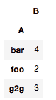
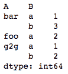

# 获取熊猫数据框中某列的频率计数

> 原文:[https://www . geeksforgeeks . org/get-frequency-counts-in-pandas-data frame/](https://www.geeksforgeeks.org/getting-frequency-counts-of-a-columns-in-pandas-dataframe/)

给定一个熊猫数据帧，我们需要在这个数据帧的一列或多列中找到每个项目的频率计数。这可以通过多种方式实现:

**方法#1:** 使用`Series.value_counts()`

这种方法适用于熊猫。系列对象。由于每个 DataFrame 对象都是 Series 对象的集合，因此我们可以应用此方法来获取一列中值的频率计数。

```py
# importing pandas as pd
import pandas as pd

# sample dataframe
df = pd.DataFrame({'A': ['foo', 'bar', 'g2g', 'g2g', 'g2g',
                         'bar', 'bar', 'foo', 'bar'],
                  'B': ['a', 'b', 'a', 'b', 'b', 'b', 'a', 'a', 'b'] })

# frequency count of column A
count = df['A'].value_counts()
print(count)
```

**输出:**


**方法 2:** 使用`GroupBy.count()`

此方法可用于计算单个列上对象的频率。将一个数据框对象分组到一列后，我们可以对结果*分组对象*应用`count()`方法，以获得包含频率计数的数据框对象。

```py
# importing pandas as pd
import pandas as pd

# sample dataframe
df = pd.DataFrame({ 'A': ['foo', 'bar', 'g2g', 'g2g', 'g2g',
                                'bar', 'bar', 'foo', 'bar'],
                   'B': ['a', 'b', 'a', 'b', 'b', 'b', 'a', 'a', 'b'] })

# Multi-column frequency count
count = df.groupby(['A']).count()
print(count)
```

**输出:**


**方法#3:** 使用`GroupBy.size()`

此方法可用于计算单列或多列上对象的频率。将一个数据框对象分组到一列或多列后，我们可以对生成的*组对象*应用`size()`方法，以获得包含频率计数的序列对象。

```py
# importing pandas as pd
import pandas as pd

# sample dataframe
df = pd.DataFrame({ 'A': ['foo', 'bar', 'g2g', 'g2g', 'g2g', 
                                'bar', 'bar', 'foo', 'bar'],
                   'B': ['a', 'b', 'a', 'b', 'b', 'b', 'a', 'a', 'b'] })

# Multi-column frequency count
count = df.groupby(['A', 'B']).size()
print(count)
```

**输出:**
