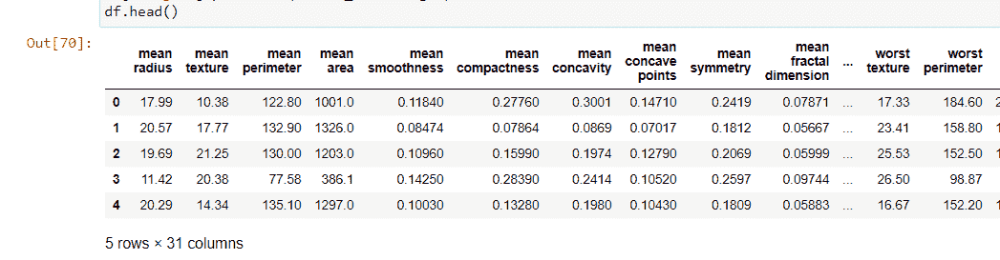

# 大熊猫无聚集群

> 原文:[https://www . geesforgeks . org/group by-无聚合熊猫/](https://www.geeksforgeeks.org/groupby-without-aggregation-in-pandas/)

Pandas 是一个很棒的 python 包，用于处理数据，我们作为初学者学习的一些工具是 pandas 的聚合和分组功能。

[**【group by()】**](https://www.geeksforgeeks.org/python-pandas-dataframe-groupby/)**是用于根据给定条件将数据帧中的数据拆分成组的函数。**聚合**另一方面对序列、数据进行操作，并返回数据的数字摘要。有很多聚合函数如 *count()、max()、min()、mean()、std()、description()*。我们可以组合这两个函数来查找特定列上的多个聚合。有关这方面的更多细节，请参考本文[如何在熊猫中组合 Groupby 和 Multiple 聚合功能。](https://www.geeksforgeeks.org/how-to-combine-groupby-and-multiple-aggregate-functions-in-pandas/)**

**我们可以在不进行聚合的情况下执行 groupby，而不是一起使用 groupby 聚合，这适用于单独聚合数据。我们将通过一个例子看到这一点，在这个例子中，我们将获取一个具有不同数字特征的乳腺癌数据集，如平均面积、最差纹理等。目标列的 0 表示癌症是良性的，1 表示癌症是恶性的。**

****例 1:****

## **蟒蛇 3**

```py
# importing python libraries and breast_cancer dataset from sklearn
import numpy as np
import pandas as pd
from sklearn import datasets
from sklearn.datasets import load_breast_cancer

# data is loaded in a DataFrame
cancer_data = load_breast_cancer()
df = pd.DataFrame(cancer_data.data, columns=cancer_data.feature_names)
df['target'] = pd.Series(cancer_data.target)
df.head()
```

****输出:****

****

**因此，我们可以可视化具有所有列的数据，但是所有列都是数字形式的，并且没有分类数据，而只有目标列，所以让我们在目标和另一个名为*“最差纹理”的列中查看一下。***

## **蟒蛇 3**

```py
print(df['target'].describe(), df['worst texture'].describe())
```

****输出:****

```py
count    569.000000
mean       0.627417
std        0.483918
min        0.000000
25%        0.000000
50%        1.000000
75%        1.000000
max        1.000000
Name: target, dtype: float64
count    569.000000
mean      25.677223
std        6.146258
min       12.020000
25%       21.080000
50%       25.410000
75%       29.720000
max       49.540000
Name: worst texture, dtype: float64
```

**这里可以看到*目标*和*最差纹理*列的总结，我们只取这几列来更好的理解 groupby 聚合函数。**

## **蟒蛇 3**

```py
df1 = df[['worst texture', 'worst area', 'target']]
gr1 = df1.groupby(df1['target']).mean()
gr1
```