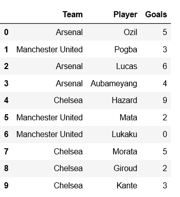
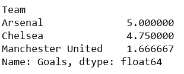
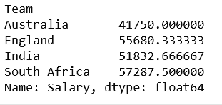

# 熊猫分组排

> 原文:[https://www.geeksforgeeks.org/grouping-rows-in-pandas/](https://www.geeksforgeeks.org/grouping-rows-in-pandas/)

Pandas 是最流行的用于数据分析的 Python 库。它提供了高度优化的性能，后端源代码完全用 C 或 Python 编写。

让我们看看如何在多个例子的帮助下对熊猫数据框中的行进行分组。

**例 1:**

为了对 pandas 中的行进行分组，我们将首先创建 Pandas 数据框。

```py
# importing Pandas
import pandas as pd

# example dataframe
example = {'Team':['Arsenal', 'Manchester United', 'Arsenal',
                   'Arsenal', 'Chelsea', 'Manchester United',
                   'Manchester United', 'Chelsea', 'Chelsea', 'Chelsea'],

           'Player':['Ozil', 'Pogba', 'Lucas', 'Aubameyang',
                       'Hazard', 'Mata', 'Lukaku', 'Morata', 
                                         'Giroud', 'Kante'],

           'Goals':[5, 3, 6, 4, 9, 2, 0, 5, 2, 3] }

df = pd.DataFrame(example)

print(df)
```



现在，创建一个分组对象，意味着一个代表该特定分组的对象。

```py
total_goals = df['Goals'].groupby(df['Team'])

# printing the means value
print(total_goals.mean())    
```

**输出:**


**例 2:**

```py
import pandas as pd

# example dataframe
example = {'Team':['Australia', 'England', 'South Africa',
                   'Australia', 'England', 'India', 'India',
                        'South Africa', 'England', 'India'],

           'Player':['Ricky Ponting', 'Joe Root', 'Hashim Amla',
                     'David Warner', 'Jos Buttler', 'Virat Kohli',
                     'Rohit Sharma', 'David Miller', 'Eoin Morgan',
                                                 'Dinesh Karthik'],

          'Runs':[345, 336, 689, 490, 989, 672, 560, 455, 342, 376],

          'Salary':[34500, 33600, 68900, 49000, 98899,
                    67562, 56760, 45675, 34542, 31176] }

df = pd.DataFrame(example)

total_salary = df['Salary'].groupby(df['Team'])

# printing the means value
print(total_salary.mean())     
```

**输出:**
