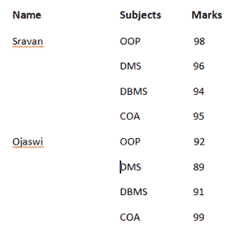
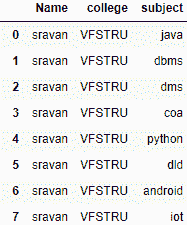
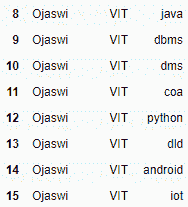
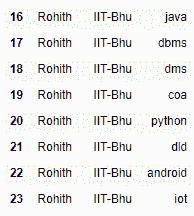

# 熊猫的等级数据

> 原文:[https://www.geeksforgeeks.org/hierarchical-data-in-pandas/](https://www.geeksforgeeks.org/hierarchical-data-in-pandas/)

在 pandas 中，我们可以从现有的数据框中排列数据。例如，我们有相同的名字和不同的功能，而不是一直写名字，我们只能写一次。我们可以使用 pandas 从现有的数据框架中创建分层数据。

**示例:**

查看学生科目详情。这里我们可以看到学生的名字总是在重复。


这样，我们需要内存来存储多个名称。我们可以通过使用数据层次结构来减少这种情况。



**示例:**

## 蟒蛇 3

```py
# import pandas  module for data frame
import pandas as pd

# Create dataframe for student data in different colleges
subjectsdata = {'Name': ['sravan', 'sravan', 'sravan', 'sravan', 
                         'sravan', 'sravan', 'sravan', 'sravan', 
                         'Ojaswi', 'Ojaswi', 'Ojaswi', 'Ojaswi', 
                         'Ojaswi', 'Ojaswi', 'Ojaswi', 'Ojaswi',
                         'Rohith', 'Rohith', 'Rohith', 'Rohith',
                         'Rohith', 'Rohith', 'Rohith', 'Rohith'],

                'college': ['VFSTRU', 'VFSTRU', 'VFSTRU', 'VFSTRU',
                            'VFSTRU', 'VFSTRU', 'VFSTRU', 'VFSTRU',
                            'VIT', 'VIT', 'VIT', 'VIT', 'VIT', 'VIT',
                            'VIT', 'VIT', 'IIT-Bhu', 'IIT-Bhu', 'IIT-Bhu', 
                            'IIT-Bhu', 'IIT-Bhu', 'IIT-Bhu', 'IIT-Bhu',
                            'IIT-Bhu'],

                'subject': ['java', 'dbms', 'dms', 'coa', 'python', 'dld',
                            'android', 'iot', 'java', 'dbms', 'dms', 'coa',
                            'python', 'dld', 'android', 'iot', 'java',
                            'dbms', 'dms', 'coa', 'python', 'dld', 'android',
                            'iot']
                }

# Convert into data frame
df = pd.DataFrame(subjectsdata)

# print the data(student records)
print(df)
```

**输出:**





## 蟒蛇 3

```py
# Set the hierarchical index
df = df.set_index(['Name', 'college'], drop=False)

# print data frame
df
```