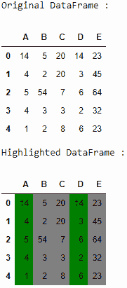
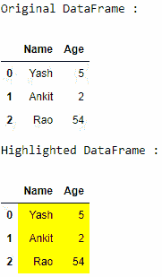

# 使用 apply()

突出显示熊猫数据框的特定列

> 原文:[https://www . geesforgeks . org/highlight-pandas-data frames-specific-columns-using-apply/](https://www.geeksforgeeks.org/highlight-pandas-dataframes-specific-columns-using-apply/)

让我们看看如何突出熊猫数据帧的特定列。我们可以使用 Styler 类的 **`apply()`** 函数来实现。

## Styler.apply()

> **语法:** Styler.apply(func，axis = 0，subset = None，**kwargs)
> 
> **参数:**
> 
> *   **函数:**函数应该取一个 Series 或 DataFrame(取决于-轴)，并返回一个具有相同形状的对象。当 axis = None 时，必须返回具有相同索引和列标签的数据框。
> *   **轴:**应用于每一列(轴=0 或“索引”)、每一行(轴=1 或“列”)或一次应用于整个数据框，轴=无
> *   **子集:**在应用函数之前限制数据的有效索引器。
> *   *** *夸脱:**字典传给**功能**。
> 
> **返回:**样式器

让我们用例子来理解:

**例 1 :**

```
# importing pandas as pd 
import pandas as pd 

# creating the dataframe
df = pd.DataFrame({"A" : [14, 4, 5, 4, 1],
                   "B" : [5, 2, 54, 3, 2],
                   "C" : [20, 20, 7, 3, 8], 
                   "D" : [14, 3, 6, 2, 6],
                   "E" : [23, 45, 64, 32, 23]}) 

print("Original DataFrame :")
display(df)

# function definition
def highlight_cols(x):

    # copy df to new - original data is not changed
    df = x.copy()

    # select all values to green color
    df.loc[:, :] = 'background-color: green'

    # overwrite values grey color
    df[['B', 'C', 'E']] = 'background-color: grey'

    # return color df
    return df 

print("Highlighted DataFrame :")
display(df.style.apply(highlight_cols, axis = None))
```

**输出:**


**例 2 :**

```
# importing pandas as pd 
import pandas as pd 

# creating the dataframe
df = pd.DataFrame({"Name" : ["Yash", "Ankit", "Rao"],
                   "Age" : [5, 2, 54]}) 

print("Original DataFrame :")
display(df)

# function definition
def highlight_cols(x):

    # copy df to new - original data is not changed
    df = x.copy()

    # select all values to yellow color
    df.loc[:, :] = 'background-color: yellow'

    # return color df
    return df 

print("Highlighted DataFrame :")
display(df.style.apply(highlight_cols, axis = None))
```

**输出:**
