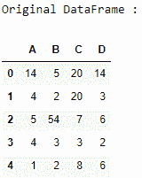
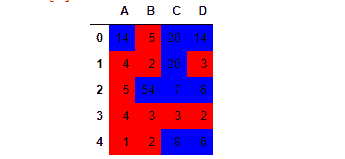
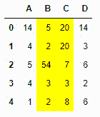
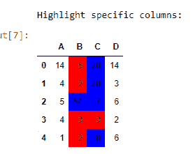

# 使用 applymap()

突出显示熊猫数据框的特定列

> 原文:[https://www . geesforgeks . org/highlight-pandas-data frames-specific-columns-using-apply map/](https://www.geeksforgeeks.org/highlight-pandas-dataframes-specific-columns-using-applymap/)

让我们看看如何突出熊猫数据框的元素和特定的列。我们可以使用 Styler 类的 **`applymap()`** 函数来实现。

## Styler.applymap()

> **语法:** Styler.applymap(self，func，subset = None，**kwargs)
> 
> **参数:**
> 
> *   **func :** 取一个标量，返回一个标量。
> *   **子集:**在应用函数之前限制数据的有效索引器。
> *   *** *夸脱:**字典传给**功能**。
> 
> **返回:**样式器

让我们用例子来理解:

首先创建一个简单的数据框:

```
# importing pandas as pd 
import pandas as pd 

# creating the dataframe  
df = pd.DataFrame({"A" : [14, 4, 5, 4, 1], 
                   "B" : [5, 2, 54, 3, 2],
                   "C" : [20, 20, 7, 3, 8],
                   "D" : [14, 3, 6, 2, 6]}) 

print("Original DataFrame :")
display(df)
```

**输出:**


**示例 1 :** 对于数据框中的每个单元格，如果该值小于 6，则我们将使用红色突出显示该单元格，否则使用蓝色。

```
# function definition
def highlight_cols(s):
    color = 'red' if s < 6 else 'blue'
    return 'background-color: % s' % color

# highlighting the cells
display(df.style.applymap(highlight_cols))
```

**输出:**


**示例 2 :** 这次我们将只突出显示某些指定列中的单元格。

```
# function definition
def highlight_cols(s):
    return 'background-color: % s' % 'yellow'

# highlighting the cells
display(df.style.applymap(highlight_cols, 
                          subset = pd.IndexSlice[:, ['B', 'C']]))
```

**输出:**


借助索引突出显示特定的列:

## 蟒蛇 3

```
df.style.applymap(highlight_cols, subset = pd.IndexSlice[:, ['B', 'C']])
```

