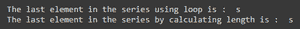

# 如何访问熊猫系列的最后一个元素？

> 原文:[https://www . geesforgeks . org/如何访问熊猫系列中的最后一个元素/](https://www.geeksforgeeks.org/how-to-access-the-last-element-in-a-pandas-series/)

**先决条件:**T2】熊猫

Pandas 系列在独立处理各种分析操作或作为 pandas 数据框架的一部分时非常有用。所以了解熊猫系列中各种操作是如何进行的对我们来说很重要。下面的文章讨论了熊猫系列的最后一个元素的各种检索方法。

**方法 1:** *天真的做法*

访问最后一个元素有两种简单的方法:

*   迭代整个系列，直到我们到达最后。
*   求数列的长度。最后一个元素是 length-1(因为索引从 0 开始)。

**程序:**

## 蟒蛇 3

```
# importing the pandas library
import pandas as pd

# initializing the series
ser = pd.Series(['g', 'e', 'e', 'k', 's'])

# iterating the series until the iterator reaches the end of the series
for i in range(0, ser.size):
    if i == ser.size-1:
        # printing the last element i.e, size of the series-1
        print("The last element in the series using loop is : ", ser[i])

# calculating the length of the series
len = ser.size

# printing the last element i.e len-1 as indexing starts from 0
print("The last element in the series by calculating length is : ", ser[len-1])
```

**输出:**



**方法二:** *使用。iloc 或。iat*

Pandas iloc 用于通过指定其整数索引来检索数据。在 python 中，负索引从末尾开始，因此我们可以通过将 index 指定为-1 而不是 length-1 来访问最后一个元素，这将产生相同的结果。

熊猫 iat 用于访问经过位置的数据。iat 比 iloc 相对更快。还要注意，ser[-1]不会打印序列的最后一个元素，因为序列只支持正索引。但是，我们可以在 iloc 和 iat 中使用负索引。

**程序:**

## 蟒蛇 3

```
# importing the pandas library and time
import pandas as pd
import time
# initializing the series
ser = pd.Series(['g', 'e', 'e', 'k', 's'])

start = time.time()
print("The last element in the series using iloc is : ", ser.iloc[-1])
end = time.time()

print("Time taken by iloc : ", end-start)

start = time.time()
print("The last element in the series using iat is : ", ser.iat[-1])
end = time.time()

print("Time taken by iat : ", end-start)
```