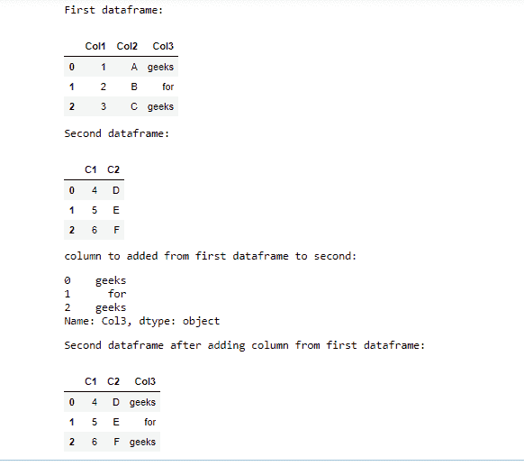
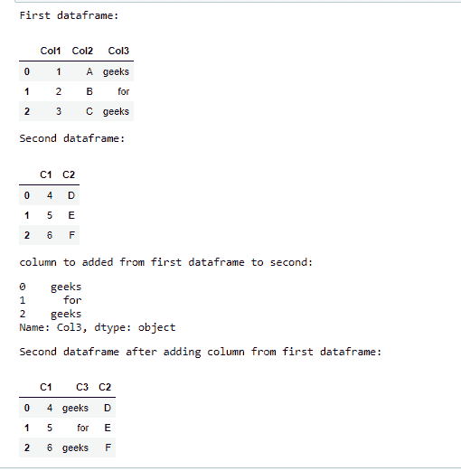

# 如何在 Pandas 中添加来自另一个数据框的列？

> 原文:[https://www . geeksforgeeks . org/如何添加来自另一个熊猫的数据框列/](https://www.geeksforgeeks.org/how-to-add-column-from-another-dataframe-in-pandas/)

在本文中，我们将讨论如何在 Pandas 中添加来自另一个数据框的列。

**方法 1:** 使用连接()

使用这种方法，要添加到第二个数据帧的列首先使用其名称从第一个数据帧中提取。这里，提取的列被分配给一个变量。

> **语法:**data frame 1[“name _ of _ the _ column”]

提取后，只需使用 join()函数将该列添加到第二个数据框中。

> **语法:** Dataframe2.join(“变量名”)

该函数需要参考数据帧来调用，在该数据帧中必须添加列，并且存储提取的列名的变量名必须作为参数传递给它。因此，该列将被添加到第二个数据帧的末尾，其名称与上一个数据帧中的名称相同。

**示例:**

## 蟒蛇 3

```py
import pandas as pd

df1 = pd.DataFrame({"Col1": [1, 2, 3], 
                    "Col2": ["A", "B", "C"],
                    "Col3": ["geeks", "for", "geeks"]})

print("First dataframe:")
display(df1)

df2 = pd.DataFrame({"C1": [4, 5, 6],
                    "C2": ["D", "E", "F"]})

print("Second dataframe:")
display(df2)

extracted_col = df1["Col3"]
print("column to added from first dataframe to second:")
display(extracted_col)

df2 = df2.join(extracted_col)
print("Second dataframe after adding column from first dataframe:")
display(df2)
```

**输出:**



**方法 2:** 使用[插入()](https://www.geeksforgeeks.org/python-pandas-dataframe-insert/)

方法与上面相同-要添加的列首先被提取并分配给一个变量，然后被添加到另一个数据帧。这里的不同之处在于，这种方法可以自由地将列放在任何地方，如果需要，可以使用不同的列名。

> **语法:**插入(位置，“new_name”，“extarcted _ column”)

这里，希望插入列的索引代替位置被传递。new_name 可以用应该重命名的列名替换，extracted_column 是第一个 dataframe 中的列。

**示例:**

## 蟒蛇 3

```py
import pandas as pd

df1 = pd.DataFrame({"Col1": [1, 2, 3],
                    "Col2": ["A", "B", "C"],
                    "Col3": ["geeks", "for", "geeks"]})
print("First dataframe:")
display(df1)

df2 = pd.DataFrame({"C1": [4, 5, 6],
                    "C2": ["D", "E", "F"]})
print("Second dataframe:")
display(df2)

extracted_col = df1["Col3"]
print("column to added from first dataframe to second:")
display(extracted_col)

df2.insert(1, "C3", extracted_col)
print("Second dataframe after adding column from first dataframe:")
display(df2)
```

**输出:**

