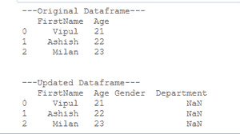
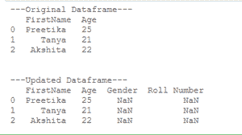
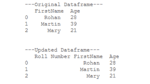

# 如何在熊猫的数据框中添加空列？

> 原文:[https://www . geesforgeks . org/如何将空列添加到熊猫数据框/](https://www.geeksforgeeks.org/how-to-add-empty-column-to-dataframe-in-pandas/)

在数据框中，空列是用“不可数”值(不是数字值或未定义或不可表示的值)定义和表示的。有多种方法可以将空列添加到熊猫数据框中。

**方法 1:使用赋值运算符。**

此方法用于强制为任何列分配 null 或 NaN 值。

## 蟒蛇 3

```
# import required libraries
import numpy as np
import pandas as pd

# create a Dataframe
Mydataframe = pd.DataFrame({'FirstName': ['Vipul',
                                          'Ashish',
                                          'Milan'],
                            "Age": [21,22,23]})
# show the dataframe
print("\n\n---Original Dataframe---\n", 
      Mydataframe)

# add an empty columns
Mydataframe['Gender'] = ''
Mydataframe['Department'] = np.nan

# show the dataframe
print("---Updated Dataframe---\n", 
      Mydataframe)
```

**输出:**



在上面的例子中，我们使用**赋值操作符**为熊猫数据帧(表)给两个新创建的列分别赋值为“性别”和“部门”。Numpy 库用于导入 NaN 值并使用其功能。

**方法 2:使用 Dataframe.reindex()。**

[**此**](https://www.geeksforgeeks.org/python-pandas-dataframe-reindex/) 方法用于在数据框中创建新列，并为这些列赋值(如果未赋值，将自动赋值为 null)。
**例:**

## 蟒蛇 3

```
# import pandas library
import pandas as pd

# create a dataframe
Mydataframe = pd.DataFrame({'FirstName': ['Preetika',
                                          'Tanya',
                                          'Akshita'],
                            "Age": [25,21,22]})
# show the dataframe
print("---Original Dataframe---\n",
      Mydataframe)

# add an empty columns
Mydataframe = Mydataframe.reindex(columns = Mydataframe.columns.tolist() 
                                  + ['Gender','Roll Number'])

# show the dataframe
print("\n\n---Updated Dataframe---\n",
      Mydataframe)
```

**输出:**



在上面的示例中，我们创建了一个包含两列“名字”和“年龄”的数据框，然后使用 **Dataframe.reindex()** 方法向具有 NaN 值的列列表中添加了两个新列“性别”和“滚动编号”。

**方法 3:使用 Dataframe.insert()。**

[**这个**](https://www.geeksforgeeks.org/python-pandas-dataframe-insert/) 方法是在我们想要的任何索引位置给熊猫数据框添加一个新的列，并根据需要分配合适的值。
**例:**

## 蟒蛇 3

```
# import pandas library
import pandas as pd

# create a dataframe
Mydataframe = pd.DataFrame({'FirstName': ['Rohan',
                                          'Martin',
                                          'Mary'],
                            "Age": [28,39,21]})
# show the dataframe
print("---Original Dataframe---\n",
      Mydataframe)

# add an empty column
Mydataframe.insert(0,'Roll Number','')

# show the dataframe
print("\n\n---Updated Dataframe---\n",
      Mydataframe)
```

**输出:**



在上面的例子中，我们在 pandas 数据帧(表)上使用 **Dataframe.insert()** 方法来添加一个空列“Roll Number”，这里我们也可以在任何我们想要的索引位置插入该列(就像这里我们将值放在索引位置 0 一样)。