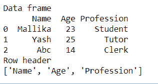

# 如何给熊猫数据框添加标题行？

> 原文:[https://www . geesforgeks . org/how-add-header-row-to-a-pandas-data frame/](https://www.geeksforgeeks.org/how-to-add-header-row-to-a-pandas-dataframe/)

标题必须存储每个列的名称或标题。它基本上帮助用户识别数据框中相应列的角色。包含列名的顶行称为数据框的标题行。基本上有两种方法可以在 Python 中添加标题行，以防原始数据帧没有标题。

**方法一:从 CSV 文件创建数据帧，创建行标题**

读取数据并将其存储在数据框中或创建新的数据框时，可以使用 read_csv()方法的 name 属性来指定列名。name 属性按顺序包含数据框中每一列的名称数组。数组的长度等于这个框架结构的长度。

## 蟒蛇 3

```py
# pandas package is required
import pandas as pd

# converting csv file to data frame
data_frame = pd.read_csv("test.txt", sep='\t',
                         names=['Name', 'Age', 'Profession'])

# printing data frame
print("Data frame")
print(data_frame)

# printing row header
print("Row header")
print(list(data_frame.columns))
```

**输出:**



我们还可以将 header=none 指定为 read_csv()方法的属性，并在以后需要时显式地为列命名。

## 蟒蛇 3

```py
# pandas package is required
import pandas as pd

# declaring a data frame  with three rowsand three columns
data_frame = pd.read_csv("test.txt")

# printing data frame
print("Original Data frame")
print(data_frame)

# adding column names
data_frame_new = pd.read_csv("test.txt", names=['A', 'B', 'C'])
print("New Data frame")
print(data_frame_new)

# printing row header
print("Row header")
print(list(data_frame_new.columns))
```

**输出:**


最初，行由从 0 开始的索引号编号，以防 CSV 文件没有任何行标题。

**方法二:在 Python 中创建数据框并创建行标题**

我们可以通过首先创建一个多维数组，然后由熊猫把它转换成一个数据框，来创建一个特定行数和列数的数据框。DataFrame()方法。**列**参数用于指定行标题或列名。它包含一个列值数组，其长度等于数据框中的列数。

## 蟒蛇 3

```py
# pandas package is required
import pandas as pd

# declaring a data frame  with three rowsand three columns
data = [['Mallika', 23, 'Student'], [
    'Yash', 25, 'Tutor'], ['Abc', 14, 'Clerk']]

# creating a pandas data frame
data_frame = pd.DataFrame(data, columns=['Name', 'Age', 'Profession'])

# printing data frame
print("Data frame")
print(data_frame)

# printing row header
print("Row header")

print(list(data_frame.columns))
```

**输出:**

