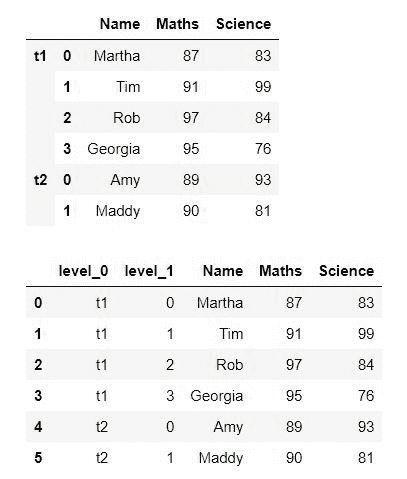
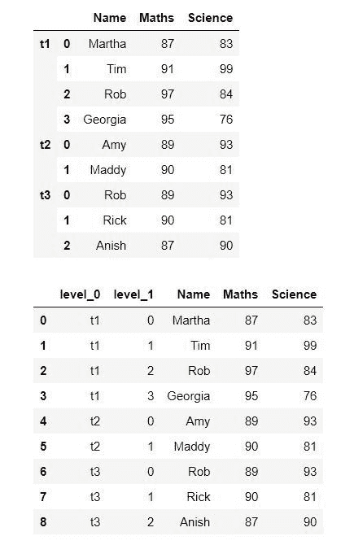

# 如何在拼接熊猫数据帧时添加标识符列？

> 原文:[https://www . geesforgeks . org/how-add-identifier-column-when-concation-pandas-data frames/](https://www.geeksforgeeks.org/how-to-add-identifier-column-when-concatenating-pandas-dataframes/)

在处理一些数据时，我们通常希望连接两个或更多的数据帧。因此，当我们连接这些数据帧时，我们实际上需要提供一个标识符列来标识连接的数据帧。在本文中，我们将借助示例来了解如何做到这一点。

**例 1:**

要添加标识符列，我们需要将标识符指定为 concat()函数中参数“key”的列表，该函数创建一个新的多索引数据帧，其中两个数据帧连接在一起。现在我们将使用 **reset_index** 将多索引数据帧转换为常规熊猫数据帧。

## 蟒蛇 3

```py
import pandas as pd
import numpy as np

dict = {'Name':['Martha', 'Tim', 'Rob', 'Georgia'],
        'Maths':[87, 91, 97, 95],
        'Science':[83, 99, 84, 76]
       }

df1 = pd.DataFrame(dict)

dict = {'Name':['Amy', 'Maddy'],
        'Maths':[89, 90],
        'Science':[93, 81]
       }

df2 = pd.DataFrame(dict)

# Concatenating two dataframes
df = pd.concat([df1,df2],keys=['t1', 't2'])
display(df)

df = pd.concat([df1,df2], keys=['t1', 't2']).reset_index()
display(df)
```

**输出:**



在输出中，我们可以看到包含每个数据帧标识符的列，其中“t1”代表第一个数据帧，“t2”代表第二个数据帧。

**例 2:**

我们可以对任意数量的数据帧进行类似的操作。在这个例子中，我们将结合三个数据帧。

## 蟒蛇 3

```py
import pandas as pd
import numpy as np

dict = {'Name': ['Martha', 'Tim', 'Rob', 'Georgia'],
        'Maths': [87, 91, 97, 95],
        'Science': [83, 99, 84, 76]
        }

df1 = pd.DataFrame(dict)

dict = {'Name': ['Amy', 'Maddy'],
        'Maths': [89, 90],
        'Science': [93, 81]
        }

df2 = pd.DataFrame(dict)

dict = {'Name': ['Rob', 'Rick', 'Anish'],
        'Maths': [89, 90, 87],
        'Science': [93, 81, 90]
        }

df3 = pd.DataFrame(dict)

# Concating Dataframes
df = pd.concat([df1, df2, df3],
               keys=['t1', 't2', 't3'])
display(df)

df = pd.concat([df1, df2, df3],
               keys=['t1', 't2', 't3']).reset_index()
display(df)
```

**输出:**



在输出中，我们可以看到每个数据帧的标识符列，其中“t1”、“t2”和“t3”分别代表第一、第二和第三个数据帧。