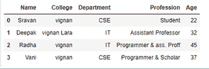
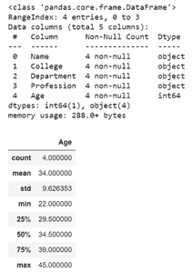
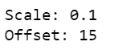
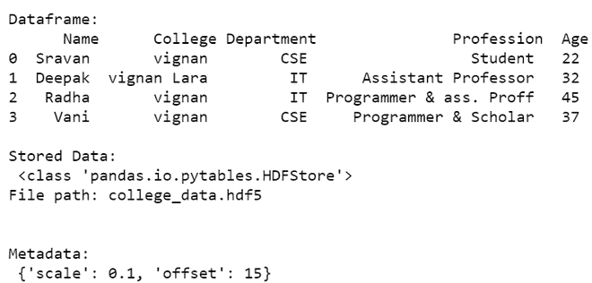
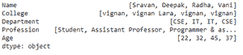
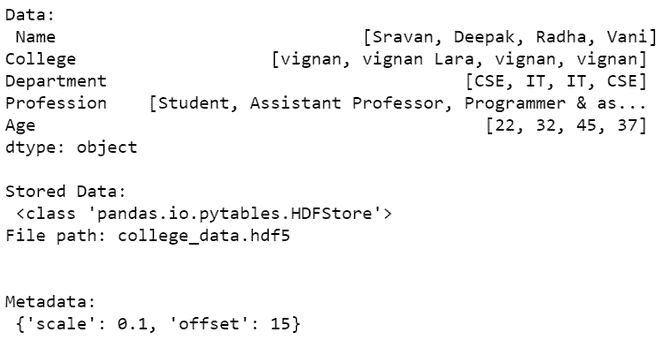

# 如何在 Python 中为带有熊猫的数据帧或系列添加元数据？

> 原文:[https://www . geesforgeks . org/如何将元数据添加到数据框或 python 熊猫系列/](https://www.geeksforgeeks.org/how-to-add-metadata-to-a-dataframe-or-series-with-pandas-in-python/)

**元数据**，也称*数据关于数据。*元数据可以给我们数据描述、摘要、在内存中的存储以及特定数据的数据类型。我们将显示和创建元数据。

**场景:**

*   我们只需使用 *info()* 命令就可以获取元数据
*   我们可以向现有数据添加元数据，并可以查看创建的数据的元数据。

**步骤:**

*   创建数据框
*   查看已经存在的元数据
*   创建元数据并查看元数据。

在这里，我们将创建一个数据框，我们可以查看并在创建的数据框上创建元数据

**查看现有元数据方法:**

*   **data frame _ name . info()**–它将以表格格式返回数据类型空值和内存使用情况
*   **data frame _ name . columns()**–它将返回一个包含数据框中所有列名的数组
*   **data frame _ name . description()**–它将给出给定数字数据框列的描述性统计数据，如平均值、中位数、标准差等。

**创建元数据**

我们可以使用 *dataframe.scale()* 和 *dataframe.offset()* 方法创建特定数据帧的元数据。它们用于表示元数据。

**语法:**

> dataframe_name.scale=value
> 
> dataframe _ name.offset =值

**以下是一些描述如何向数据框或系列添加元数据的示例:**

**例 1**

最初创建并显示一个数据帧。

## 蟒蛇 3

```py
# import required modules
import pandas as pd

# initialise data of lists using dictionary
data = {'Name': ['Sravan', 'Deepak', 'Radha', 'Vani'],
        'College': ['vignan', 'vignan Lara', 'vignan', 'vignan'],
        'Department': ['CSE', 'IT', 'IT', 'CSE'],
        'Profession': ['Student', 'Assistant Professor',
                       'Programmer & ass. Proff',
                       'Programmer & Scholar'],
        'Age': [22, 32, 45, 37]
        }

# create dataframe
df = pd.DataFrame(data)

# print dataframe
df
```

**输出:**



然后检查数据帧属性和描述。

## 蟒蛇 3

```py
# data information
df.info()

# data columns description
df.columns

# describing columns
df.describe()
```

**输出:**



初始化数据帧的偏移量和比例。

## 蟒蛇 3

```py
# initializing scale and offset
# for creating meta data
df.scale = 0.1
df.offset = 15

# display scale and and offset
print('Scale:', df.scale)
print('Offset:', df.offset)
```

**输出:**



我们以 *hdf5* 文件格式存储数据，然后我们将显示数据帧及其存储的元数据。

## 蟒蛇 3

```py
# store in hdf5 file format
storedata = pd.HDFStore('college_data.hdf5')

# data
storedata.put('data_01', df)

# including metadata
metadata = {'scale': 0.1, 'offset': 15}

# getting attributes
storedata.get_storer('data_01').attrs.metadata = metadata

# closing the storedata
storedata.close()

# getting data
with pd.HDFStore('college_data.hdf5') as storedata:
    data = storedata['data_01']
    metadata = storedata.get_storer('data_01').attrs.metadata

# display data
print('\nDataframe:\n', data)

# display stored data
print('\nStored Data:\n', storedata)

# display metadata
print('\nMetadata:\n', metadata)
```

**输出:**



**例 2**

熊猫系列数据结构不支持信息和所有方法。所以我们直接创建元数据并显示。

## 蟒蛇 3

```py
# import required module
import pandas as pd

# initialise data of lists using dictionary.
data = {'Name': ['Sravan', 'Deepak', 'Radha', 'Vani'],
        'College': ['vignan', 'vignan Lara', 'vignan', 'vignan'],
        'Department': ['CSE', 'IT', 'IT', 'CSE'],
        'Profession': ['Student', 'Assistant Professor',
                       'Programmer & ass. Proff',
                       'Programmer & Scholar'],
        'Age': [22, 32, 45, 37]
        }

# Create series
ser = pd.Series(data)

# display data
ser
```

**输出:**



现在我们将存储元数据，然后显示它。

## 蟒蛇 3

```py
# storing data in hdf5 file format
storedata = pd.HDFStore('college_data.hdf5')

# data
storedata.put('data_01', ser)

# mentioning scale and offset
metadata = {'scale': 0.1, 'offset': 15}

storedata.get_storer('data_01').attrs.metadata = metadata

# storing close
storedata.close()

# getting attributes
with pd.HDFStore('college_data.hdf5') as storedata:
    data = storedata['data_01']
    metadata = storedata.get_storer('data_01').attrs.metadata

# display data
print('\nData:\n', data)

# display stored data
print('\nStored Data:\n', storedata)

# display Metadata
print('\nMetadata:\n', metadata)
```

**输出:**

