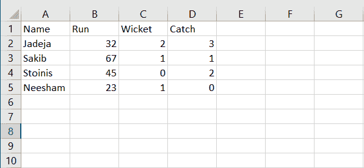
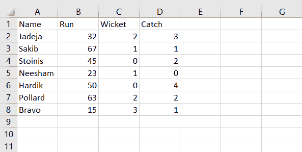

# 如何将熊猫数据帧追加到现有 CSV 文件中？

> 原文:[https://www . geesforgeks . org/how-append-pandas-data frame-to-existing-CSV-file/](https://www.geeksforgeeks.org/how-to-append-pandas-dataframe-to-existing-csv-file/)

在本文中，我们将讨论如何使用 Python 将 Pandas 数据帧追加到现有的 CSV 文件中。

追加 dataframe 意味着向现有文件添加数据行。要将数据帧逐行添加到现有的 CSV 文件中，我们可以使用 pandas [到 _csv](https://www.geeksforgeeks.org/python-pandas-series-to_csv/) ()函数，在追加模式下通过参数 a 将数据帧写入 CSV 文件。

**语法**:

> df.to_csv('existing.csv '，模式='a '，索引=False，标头=False)
> 
> **参数:**
> 
> *   **现有. csv:** 现有 csv 文件的名称。
> *   **模式:**默认模式为“w”，会覆盖文件。使用“a”将数据追加到文件中。
> *   **索引:** False 表示追加新数据时不包含索引列。True 表示追加新数据时包含索引列。
> *   **表头:** False 表示追加新数据时不包含表头。True 表示追加新数据时包含标题。

## 逐步实施

以下是将熊猫数据帧附加到现有 CSV 文件的步骤。

### 步骤 1:查看现有的 CSV 文件

首先，找到我们想要在其中追加数据帧的 CSV 文件。我们有一个现有的 CSV 文件，里面有玩家的名字和跑位，检票口和接球。我们想在这个 CSV 文件中添加更多的玩家数据。以下是现有 CSV 文件的外观:



### 步骤 2:创建新的数据帧进行追加

现在假设我们想在这个 CSV 文件中添加更多的玩家。首先创建一个玩家的数据帧，包括他们相应的跑位、三柱门和接球。制作他们的熊猫数据框。我们将把它附加到现有的 CSV 文件中。

### 步骤 3:将数据框附加到现有的 CSV 文件

让我们将数据帧附加到现有的 CSV 文件中。下面是 python 代码。

## 蟒蛇 3

```
# Append Pandas DataFrame to Existing CSV File
# importing pandas module
import pandas as pd

# data of Player and their performance
data = {
    'Name': ['Hardik', 'Pollard', 'Bravo'],
    'Run': [50, 63, 15],
    'Wicket': [0, 2, 3],
    'Catch': [4, 2, 1]
}

# Make data frame of above data
df = pd.DataFrame(data)

# append data frame to CSV file
df.to_csv('GFG.csv', mode='a', index=False, header=False)

# print mesaage
print("Data appended successfully.")
```

**输出**:

