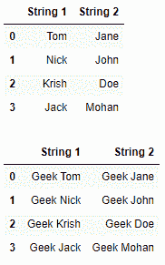
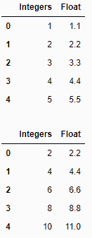

# 如何将一个函数应用于 Pandas 中的多列？

> 原文:[https://www . geeksforgeeks . org/如何将函数应用于多列熊猫/](https://www.geeksforgeeks.org/how-to-apply-a-function-to-multiple-columns-in-pandas/)

让我们看看如何将一个函数应用于熊猫数据框中的多列。要执行此任务，将使用 [**应用()**](https://www.geeksforgeeks.org/python-pandas-apply/) 功能。

## 熊猫。数据框.应用

该函数沿数据框的轴应用一个函数。

> **语法:**数据帧应用(参数)
> **参数:**
> 
> *   **函数:**应用于每一列或每一行的函数。
> *   **轴:**应用功能的轴
> *   **原始:**确定行或列是否作为序列或数组对象传递。
> *   **result_type :** '扩展'，'减少'，'广播'，无；默认无
> *   **参数:**除了数组/序列之外，要传递给 func 的位置参数。
> *   ****kwds :** 要作为关键字参数传递给 func 的附加关键字参数。
> 
> **返回:**系列或数据框

**示例 1 :** 在两列中的每个元素前添加“极客”。

## 蟒蛇 3

```py
# import the module
import pandas as pd

# creating a DataFrame
df = pd.DataFrame({'String 1' :['Tom', 'Nick', 'Krish', 'Jack'],
                   'String 2' :['Jane', 'John', 'Doe', 'Mohan']})

# displaying the DataFrame
display(df)

# function for prepending 'Geek'
def prepend_geek(name):
    return 'Geek ' + name

# executing the function
df[["String 1", "String 2"]] = df[["String 1", "String 2"]].apply(prepend_geek)

# displaying the DataFrame
display(df)
```

**输出:**



**例 2 :** 将每个元素的值乘以 2

## 蟒蛇 3

```py
# import the module
import pandas as pd

# creating a DataFrame
df = pd.DataFrame({'Integers' :[1, 2, 3, 4, 5],
                   'Float' :[1.1, 2.2, 3.3, 4.4 ,5.5]})

# displaying the DataFrame
display(df)

# function for prepending 'Geek'
def multiply_by_2(number):
    return 2 * number

# executing the function
df[["Integers", "Float"]] = df[["Integers", "Float"]].apply(multiply_by_2)

# displaying the DataFrame
display(df)
```

**输出:**

