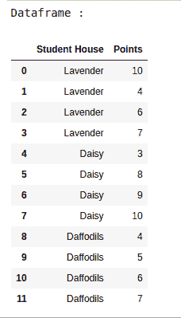
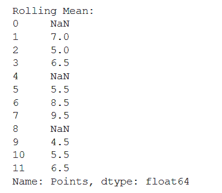
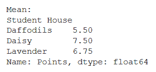
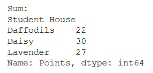

# 如何在熊猫数据框中应用一组函数？

> 原文:[https://www . geesforgeks . org/如何应用熊猫群中的函数-数据框/](https://www.geeksforgeeks.org/how-to-apply-functions-in-a-group-in-a-pandas-dataframe/)

在本文中，让我们看看如何在熊猫数据框中的一个组中应用函数。执行此任务需要遵循的步骤是–

*   **导入**必要的**库**。
*   将数据设置为**熊猫数据框**。
*   使用 ***应用*** 功能来查找不同的统计度量，如滚动平均值、平均值、总和、最大值和最小值。您可以为此使用[**λ功能**](https://www.geeksforgeeks.org/python-lambda-anonymous-functions-filter-map-reduce/) 。

下面是实现-

让我们创建数据帧。

## 蟒蛇 3

```
#import libraries
import pandas as pd

# set up the data
data_dict = {"Student House": ["Lavender", "Lavender", "Lavender",
                               "Lavender", "Daisy", "Daisy", 
                               "Daisy", "Daisy", "Daffodils", 
                               "Daffodils", "Daffodils", "Daffodils"],

             "Points": [10, 4, 6, 7, 3, 8, 9, 10, 4, 5, 6, 7]}

data_df = pd.DataFrame(data_dict)
print("Dataframe : ")
data_df
```

**输出:**



**例 1:**

## 蟒蛇 3

```
# finding rolling mean
rolling_mean = data_df.groupby("Student House")["Points"].apply(
    lambda x: x.rolling(center=False, window=2).mean())

print("Rolling Mean:")
print(rolling_mean)
```

**输出:**



**例 2:**

## 蟒蛇 3

```
# finding mean
mean = data_df.groupby("Student House")["Points"].apply(
  lambda x: x.mean())

print("Mean:")
print(mean)
```

**输出:**



**例 3:**

## 蟒蛇 3

```
# finding sum
sum = data_df.groupby("Student House")["Points"].apply(
  lambda x: x.sum())

print("Sum:")
print(sum)
```

**输出:**

