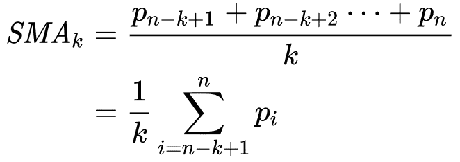
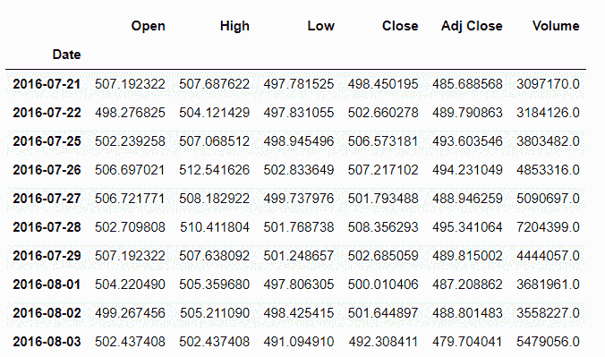
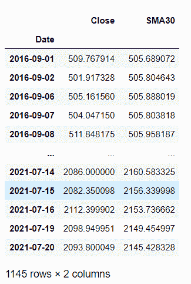
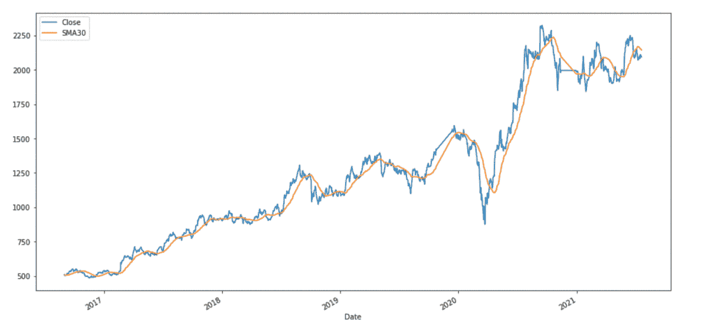
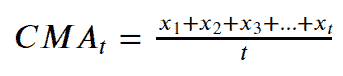
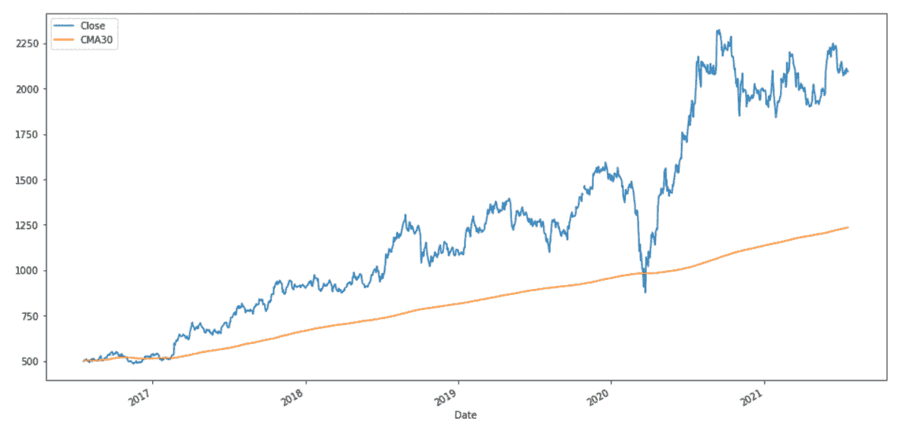
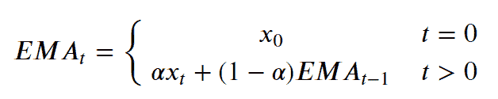
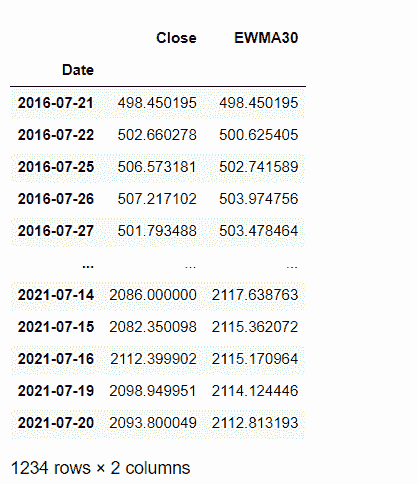
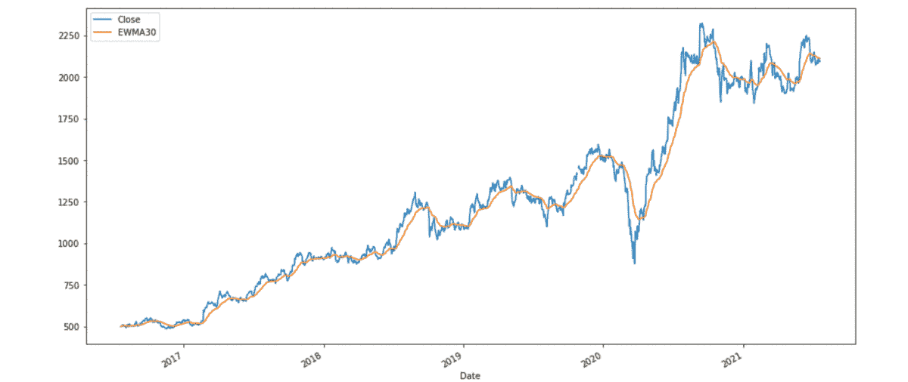

# 如何计算熊猫数据帧中的移动平均线？

> 原文:[https://www . geesforgeks . org/如何计算熊猫移动平均线-数据框/](https://www.geeksforgeeks.org/how-to-calculate-moving-average-in-a-pandas-dataframe/)

在这篇文章中，我们将研究如何计算熊猫数据帧中的移动平均线。移动平均是计算一段时间内数据的平均值。移动平均值也称为滚动平均值，它是通过对 k 个时间段内的时间序列数据进行平均来计算的。

### **均线有三种类型:**

*   简单移动平均线
*   指数移动平均线
*   累积移动平均线

**使用的数据链接是 [RELIANCE。NS_](https://media.geeksforgeeks.org/wp-content/cdn-uploads/20211115142000/RELIANCE.NS_.csv)**

## **简单移动平均线(SMA)**

 **简单移动平均线告诉我们之前 K 个数据点的未加权平均值。K 值越大，曲线越平滑，但增加 K 会降低精度。如果数据点为 p <sub>1、</sub> p <sub>2</sub> 。。。，p <sub>n</sub> 那么我们计算简单移动平均线。



在 Python 中，我们可以利用计算移动平均线。rolling()方法。这种方法提供了数据的滚动窗口，我们可以使用这些窗口的均值函数来计算移动平均线。窗口的大小作为参数在函数中传递。滚动(窗口)。

现在我们来看一个如何计算 30 天内简单滚动平均值的例子。

### 第一步:导入库

## python 3

```py
# importing Libraries

# importing pandas as pd
import pandas as pd

# importing numpy as np
# for Mathematical calculations
import numpy as np

# importing pyplot from matplotlib as plt
# for plotting graphs
import matplotlib.pyplot as plt
plt.style.use('default')
%matplotlib inline
```

### 第二步:导入数据

要导入数据我们将使用熊猫。 [read_csv()](https://www.geeksforgeeks.org/python-read-csv-using-pandas-read_csv/) 功能。

## 蟒 3

```py
# importing time-series data
reliance = pd.read_csv('RELIANCE.NS.csv', index_col='Date',
                       parse_dates=True)

# Printing dataFrame
reliance.head()
```** 

**输出:**



### 第三步:计算简单移动平均线

为了在 Python 中计算形状记忆合金，我们将使用熊猫[**data frame . rolling()**](https://www.geeksforgeeks.org/python-pandas-dataframe-rolling/)函数来帮助我们在滚动窗口上进行计算。在滚动窗口上，我们将使用。mean()函数计算每个窗口的平均值。

> **语法:**数据帧滚动(窗口，最小周期=无，中心=假，win _ type =无，开=无，轴=0)。平均值()
> 
> **参数:**
> 
> *   **窗口**:窗口大小。这就是我们在计算每一个窗口时需要观察的次数。
> *   **min_periods** :窗口中需要有值的最少观察次数(否则结果为 n a)。
> *   **居中**:用于将标签设置在窗口的中央。
> *   **win_type** :用于设置窗口类型。
> *   上的**:我们必须计算滚动平均值的数据帧的 Datetime 列。**
> *   **轴**:整数或字符串，默认为 0

## 蟒蛇 3

```py
# updating our dataFrame to have only
# one column 'Close' as rest all columns
# are of no use for us at the moment
# using .to_frame() to convert pandas series
# into dataframe.
reliance = reliance['Close'].to_frame()

# calculating simple moving average
# using .rolling(window).mean() ,
# with window size = 30
reliance['SMA30'] = reliance['Close'].rolling(30).mean()

# removing all the NULL values using 
# dropna() method
reliance.dropna(inplace=true)

# printing Dataframe
reliance
```

**输出:**



### 第四步:绘制简单移动平均线

## 蟒蛇 3

```py
# plotting Close price and simple
# moving average of 30 days using .plot() method
reliance[['Close', 'SMA30']].plot(label='RELIANCE', 
                                  figsize=(16, 8))
```

**输出:**



## 累积移动平均线

累计移动平均线是当前值之前所有值的平均值。数据点的 CMA x<sub>1</sub>，x <sub>2</sub> …..在时间 t 可以计算为，



在计算 CMA 时，我们没有任何固定大小的窗口。窗户的尺寸不断增大，久而久之。在 Python 中，我们可以使用计算 CMA。expanding()方法。现在我们来看一个例子，计算 30 天的 CMA。

### 步骤 1:导入库

## 蟒蛇 3

```py
# importing Libraries

# importing pandas as pd
import pandas as pd

# importing numpy as np
# for Mathematical calculations
import numpy as np

# importing pyplot from matplotlib as plt
# for plotting graphs
import matplotlib.pyplot as plt
plt.style.use('default')
%matplotlib inline
```

### 步骤 2:导入数据

为了导入数据，我们将使用熊猫。read_csv()函数。

## 蟒蛇 3

```py
# importing time-series data
reliance = pd.read_csv('RELIANCE.NS.csv', 
                       index_col='Date',
                       parse_dates=True)

# Printing dataFrame
reliance.head()
```

### 第三步:计算累计移动平均线

为了在 Python 中计算 CMA，我们将使用 **dataframe.expanding()** 函数。这个方法给出了聚合函数的累积值(在这种情况下是平均值)。

> **语法:**data frame . expanding(min _ periods = 1，center=None，axis=0，method='single ')。平均值()
> 
> **参数:**
> 
> *   **min_periods** : int，默认 1 **。**窗口中需要有值的最少观察次数(否则结果为“无”)。
> *   **居中** : bool，默认 False。用于设置窗口中心的标签。
> *   **轴** : int 或 str，默认为 0
> *   **方法** : str {'single '，' table'}，默认为' single '

## 蟒蛇 3

```py
# updating our dataFrame to have only
# one column 'Close' as rest all columns 
# are of no use for us at the moment
# using .to_frame() to convert pandas series
# into dataframe.
reliance = reliance['Close'].to_frame()

# calculating cumulative moving
# average using .expanding().mean()
reliance['CMA30'] = reliance['Close'].expanding().mean()

# printing Dataframe
reliance
```

**输出:**


### 第 4 步:绘制累积移动平均线

## 蟒蛇 3

```py
# plotting Close price and cumulative moving
# average of 30 days using .plot() method
reliance[['Close', 'CMA30']].plot(label='RELIANCE', 
                                  figsize=(16, 8))
```

**输出:**



## 指数移动平均线:

指数移动平均线(EMA)告诉我们之前 K 个数据点的加权平均值。均线对最近的数据点赋予了更大的权重和重要性。计算 t 时间段均线的公式为:



其中 x <sub>t</sub> 是时间 t 的观测值& α是平滑因子。在 Python 中，均线是使用。ewm()方法。我们可以将跨度或窗口作为参数传递给。ewm(span =)方法。

现在我们将看一个计算 30 天均线的例子。

### 步骤 1:导入库

## 蟒蛇 3

```py
# importing Libraries

# importing pandas as pd
import pandas as pd

# importing numpy as np
# for Mathematical calculations
import numpy as np

# importing pyplot from matplotlib as plt
# for plotting graphs
import matplotlib.pyplot as plt
plt.style.use('default')
%matplotlib inline
```

### 步骤 2:导入数据

为了导入数据，我们将使用熊猫。read_csv()函数。

## 蟒蛇 3

```py
# importing time-series data
reliance = pd.read_csv('RELIANCE.NS.csv',
                       index_col='Date',
                       parse_dates=True)

# Printing dataFrame
reliance.head()
```

**输出:**


### 第三步:计算指数移动平均线

为了在 Python 中计算均线，我们使用 dataframe.ewm()函数。它为我们提供了指数加权函数。我们将使用。计算均线的 mean()函数。

> **语法:**data frame . ewm(com =无，span =无，半衰期=无，alpha =无，min_periods=0，adjust=True，ignore_na=False，axis=0，times =无)。平均值()
> 
> **参数:**
> 
> *   **com** :浮动，可选。这是质量中心的衰减。
> *   **跨度**:浮动，可选。这是跨度的衰减。
> *   **半衰期**:浮点、str、timedelta，可选。这是半衰期的衰减。
> *   **alpha** :浮动，可选。它是平滑因子，值介于 0 和 1 之间，包括 0 和 1。
> *   **min_periods** : int，默认 0。窗口中需要有值的最少观察次数(否则结果为“无”)。
> *   **调整** : bool，默认 True。除以期初的衰减调整系数，以说明相对权重的不平衡(将 EWMA 视为移动平均线)
> *   **ignore_na** :计算权重时忽略缺失值；指定“真”以重现 0.15.0 之前的行为。
> *   **轴**:要使用的轴。值 0 标识行，1 标识列。

## 蟒蛇 3

```py
# updating our dataFrame to have only
# one column 'Close' as rest all columns
# are of no use for us at the moment
# using .to_frame() to convert pandas 
# series into dataframe.
reliance = reliance['Close'].to_frame()

# calculating exponential moving average
# using .ewm(span).mean() , with window size = 30
reliance['EWMA30'] = reliance['Close'].ewm(span=30).mean()

# printing Dataframe
reliance
```

**输出:**



### 第四步:绘制指数移动平均线

## 蟒蛇 3

```py
# plotting Close price and exponential 
# moving averages of 30 days
# using .plot() method
reliance[['Close', 'EWMA30']].plot(label='RELIANCE',
                                   figsize=(16, 8))
```

**输出:**

