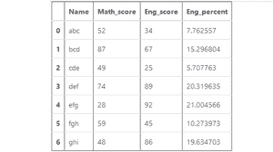

# 如何计算熊猫一栏的百分比？

> 原文:[https://www . geeksforgeeks . org/如何计算熊猫栏的百分比/](https://www.geeksforgeeks.org/how-to-calculate-the-percentage-of-a-column-in-pandas/)

A **百分比**由数值除以所有数值之和再乘以 100 的数学公式计算得出。这也适用于熊猫数据帧。这里，熊猫系列的预定义 [**sum()**](https://www.geeksforgeeks.org/python-pandas-series-sum/) 方法用于计算一列所有值的总和。

> **语法:** Series.sum()
> 
> **返回:**返回数值之和。

**公式:**

```py
df[percent] = (df['column_name'] / df['column_name'].sum()) * 100

```

**例 1:**

## 蟒蛇 3

```py
# Import required libraries
import pandas as pd
import numpy as np

# Dictionary
df1 = {
     'Name': ['abc', 'bcd', 'cde',
             'def', 'efg', 'fgh',
             'ghi'],
     'Math_score': [52, 87, 49,
                   74, 28, 59,
                   48]}

# Create a DataFrame
df1 = pd.DataFrame(df1, 
                   columns = ['Name',
                             'Math_score'])

# Calculating Percentage
df1['percent'] = (df1['Math_score'] / 
                  df1['Math_score'].sum()) * 100

# Show the dataframe
df1
```

**输出:**


**例 2:**

## 蟒蛇 3

```py
# Import pandas library
import pandas as pd

# Dictionary
df1 = {
     'Name': ['abc', 'bcd', 'cde',
             'def', 'efg', 'fgh',
             'ghi'],
      'Math_score': [52, 87, 49,
                    74, 28, 59,
                    48],
       'Eng_score': [34, 67, 25, 
                    89, 92, 45,
                    86]
}

# Create a DataFrame
df1 = pd.DataFrame(df1, 
                   columns = ['Name',
                   'Math_score','Eng_score'])

# Calculate Percentage
df1['Eng_percent'] = (df1['Eng_score'] / 
                      df1['Eng_score'].sum()) * 100
# Show the dataframe
df1
```

**输出:**

