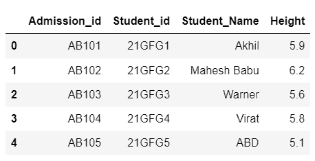
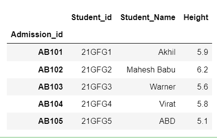
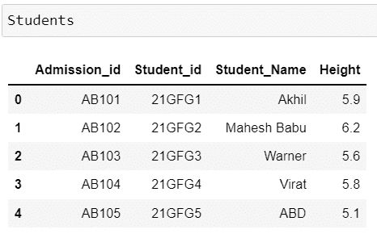

# 如何改变大熊猫的指数值？

> 原文:[https://www . geesforgeks . org/如何改变熊猫的指数值/](https://www.geeksforgeeks.org/how-to-change-index-values-in-pandas/)

**索引**是**用来唯一标识*熊猫数据框*中的一行**。它只不过是一行的标签。如果我们在创建时没有为数据帧指定索引值，那么它将采用默认值，即从 0 到 n-1 的数字，其中 n 表示行数。

让我们创建一个数据帧

**例**:

## 蟒蛇 3

```py
# import necessary packages
import pandas as pd

# create a dataframe
Students = pd.DataFrame({'Admission_id': ['AB101', 'AB102', 'AB103',
                                          'AB104', 'AB105'],
                         'Student_id': ['21GFG1', '21GFG2', '21GFG3', 
                                        '21GFG4', '21GFG5'],
                         'Student_Name': ['Akhil', 'Mahesh Babu', 'Warner',
                                          'Virat', 'ABD'],
                         'Height': [5.9, 6.2, 5.6, 5.8, 5.10]})
# display dataframe
Students
```

**输出:**



## 方法一:使用 [set_index()](https://www.geeksforgeeks.org/python-pandas-dataframe-set_index/)

要更改索引值，我们需要使用熊猫中可用的 ***set_index*** 方法来指定索引。

**语法**

> data frame name . set _ Index(" column _ name _ to _ setas _ Index "，inplace=True/False)

哪里，

*   inplace 参数接受 True 或 False，这指定索引的更改是永久的还是临时的。
*   True 表示更改是永久的。
*   False 表示更改是临时的。

**例 1:**

通过在位置中指定***= False*****(或)**来临时更改索引，我们可以将其设为**而不指定位置参数**，因为默认情况下*的位置值为 False。*

## 蟒蛇 3

```py
# import necessary packages
import pandas as pd

# create a dataframe
Students = pd.DataFrame({'Admission_id': ['AB101', 'AB102', 'AB103', 
                                          'AB104', 'AB105'],
                         'Student_id': ['21GFG1', '21GFG2', '21GFG3',
                                        '21GFG4', '21GFG5'],
                         'Student_Name': ['Akhil', 'Mahesh Babu', 'Warner',
                                          'Virat', 'ABD'],
                         'Height': [5.9, 6.2, 5.6, 5.8, 5.10]})

# setting admission id as index but temperorly
Students.set_index("Admission_id")
```

**输出:**



但是当我们在 DataFrame 中显示数据时，它仍然像以前一样，因为执行的操作不是保存的，因为它是一个临时操作。



**解释**–由于我们**没有在*****set _ index*****方法**中的 **参数中指定***T5】，默认为假，视为临时操作。*

**例 2 :**

通过在 ***set_index*** 方法中指定 ***inplace=True*** 来永久更改索引。

**例**:

## 蟒蛇 3

```py
# import necessary packages
import pandas as pd

# create a dataframe
Students = pd.DataFrame({'Admission_id': ['AB101', 'AB102', 'AB103', 
                                          'AB104', 'AB105'],
                         'Student_id': ['21GFG1', '21GFG2', '21GFG3', 
                                        '21GFG4', '21GFG5'],
                         'Student_Name': ['Akhil', 'Mahesh Babu', 'Warner',
                                          'Virat', 'ABD'],
                         'Height': [5.9, 6.2, 5.6, 5.8, 5.10]})

# setting student id as index but permanenetly
Students.set_index("Student_id", inplace=True)

# display dataframe
Students
```