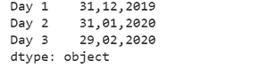
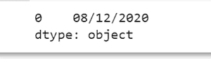
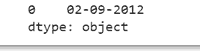

# 如何在 Python 中更改 Pandas datetime 格式？

> 原文:[https://www . geeksforgeeks . org/how-to-change-pandas-datetime-format-in-python/](https://www.geeksforgeeks.org/how-to-change-the-pandas-datetime-format-in-python/)

**先决条件** : [熊猫](https://www.geeksforgeeks.org/pandas-tutorial/)

日期时间默认格式为“YYYY-MM-DD”。因此，2020 年 12 月 8 日的日期格式将显示为“2020-12-08”。日期时间格式可以更改，我们所说的更改是指更改格式的顺序和样式。

### **使用的功能**

strftime()可以在 python 中更改日期格式。

**语法:**

```
strftime(format) 
```

其中，format 是表示所需日期格式类型的字符串。

*   年 **%y**
*   月 **%m**
*   第 **%d** 天

### **接近**

*   导入模块
*   提供日期
*   使用上述功能更改格式

**例**

## 蟒蛇 3

```
# importing pandas as pd
import pandas as pd

# Creating the date series
date_sr = pd.Series(pd.date_range(
    '2019-12-31', periods=3, freq='M', tz='Asia/Calcutta'))

# Creating the index
ind = ['Day 1', 'Day 2', 'Day 3']

# set the index
date_sr.index = ind
change_format = date_sr.dt.strftime('%d,%m,%Y')

# Print the formated date
print(change_format)
```

**输出**



**例**

## 蟒蛇 3

```
# importing pandas as pd
import pandas as pd

# change in date time format
date_sr = pd.to_datetime(pd.Series("2020-12-08"))
change_format = date_sr.dt.strftime('%d/%m/%Y')

# Print the formated date
print(change_format)
```

**输出**



**例**

## 蟒蛇 3

```
# importing pandas as pd
import pandas as pd

# change in date time format
date_sr = pd.to_datetime(pd.Series("2012-09-02"))
change_format = date_sr.dt.strftime('%d-%m-%Y')

# Print the formated date
print(change_format)
```

**输出**

