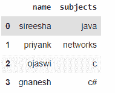
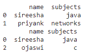
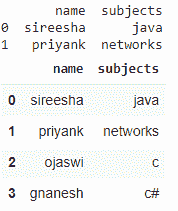

# 如何从字符串列表中检查 Pandas 列是否有值？

> 原文:[https://www . geesforgeks . org/如何从字符串列表中检查熊猫-列是否有值/](https://www.geeksforgeeks.org/how-to-check-if-pandas-column-has-value-from-list-of-string/)

在本文中，我们将看到如何在 Python 中检查 pandas 列是否具有字符串列表中的值。

字符串列表意味着列表包含字符串作为元素，我们将检查 pandas dataframe 是否具有字符串列表中的值，并在它们存在时显示它们。我们将获取列表中字符串包含的 dataframe 列。

### 创建示例数据帧:

## 蟒蛇 3

```
#import pandas
import pandas

# create dataframe
data = pandas.DataFrame({'name': ['sireesha', 'priyank', 
                                  'ojaswi', 'gnanesh'], 
                         'subjects': ['java', 'networks',
                                      'c', 'c#']})

# display
data
```

**输出:**



## 方法一:使用 [isin()](https://www.geeksforgeeks.org/python-pandas-dataframe-isin/) 功能

在这种情况下，isin()函数检查包含列表中出现的字符串的 pandas 列，并在出现列值时返回列值，否则它将不会选择 dataframe 列。

> **语法**:data frame[data frame[' column _ name ']。isin(字符串列表)]
> 
> 在哪里
> 
> *   数据帧是输入数据帧
> *   字符串列表是包含字符串的列表
> *   column_name 是用于检查该列中字符串列表的列

**示例** : Python 程序，用于检查 pandas 列是否具有字符串列表中的值

## 蟒蛇 3

```
#import pandas
import pandas

# create dataframe
data = pandas.DataFrame({'name': ['sireesha', 'priyank',
                                  'ojaswi', 'gnanesh'],
                         'subjects': ['java', 'networks',
                                      'c', 'c#']})

# consider a list
list1 = ['sireesha', 'priyank']

# check the pandas name column
# contain the given list if strings
print(data[data['name'].isin(list1)])

# consider a list
list2 = ['java', 'c']

# check the pandas subjects column
# contain the given list if strings
print(data[data['subjects'].isin(list2)])
```

**输出:**



## 方法二:使用 [NumPy](https://www.geeksforgeeks.org/numpy-in-python-set-1-introduction/)

这里，NumPy 还使用 isin()运算符来检查 pandas 列是否具有字符串列表中的值。

> **语法**:data frame[~ numpy . isin(data frame[' column ']，list_of_value)]

**示例:**

## 蟒蛇 3

```
# import pandas
import pandas

# import numpy
import numpy

# create dataframe
data = pandas.DataFrame({'name': ['sireesha', 'priyank',
                                  'ojaswi', 'gnanesh'], 
                         'subjects': ['java', 'networks', 
                                      'c', 'c#']})

# consider a list
list1 = ['sireesha', 'priyank']

# check the pandas name column
# contain the given list if strings
print(data[data['name'].isin(list1)])

# consider a list
list2 = ['java', 'c']

# check the pandas subjects column
# contain the given list if strings
data[~numpy.isin(data['subjects'], list1)]
```

**输出:**

