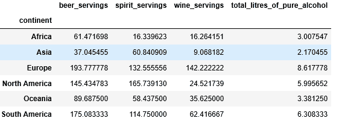
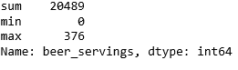
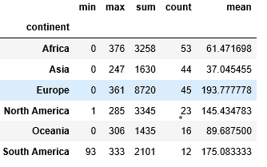

# 大熊猫如何将 Groupby 和多重聚合功能结合起来？

> 原文:[https://www . geeksforgeeks . org/如何组合熊猫中的分组和多重聚合功能/](https://www.geeksforgeeks.org/how-to-combine-groupby-and-multiple-aggregate-functions-in-pandas/)

**[【熊猫】](https://www.geeksforgeeks.org/pandas-tutorial/)** 是一个 Python 包，提供了各种数据结构和操作来操作数字数据和时间序列。它主要是流行的，因为导入和分析数据容易得多。这是一个建立在 NumPy 库之上的开源库。

### groupby(群件)

熊猫`[dataframe.groupby()](https://www.geeksforgeeks.org/pandas-groupby/)`功能用于根据给定的条件将数据帧中的数据分成组。

**例 1:**

```py
# import library
import pandas as pd

# import csv file
df = pd.read_csv("https://bit.ly/drinksbycountry")

df.head()
```

**输出:**


**例 2:**

```py
# Find the average of each continent
# by grouping the data  
# based on the "continent".
df.groupby(["continent"]).mean()
```

**输出:**


### 合计()

Pandas `[dataframe.agg()](https://www.geeksforgeeks.org/python-pandas-dataframe-aggregate/)`功能用于对基于指定轴的数据进行一个或多个操作

**示例:**

```py
# here sum, minimum and maximum of column 
# beer_servings is calculatad
df.beer_servings.agg(["sum", "min", "max"])
```

**输出:**


**将这两个函数结合起来使用:**我们可以找到由另一列分组的特定列的多个聚合函数。

**示例:**

```py
# find an aggregation of column "beer_servings"
# by grouping the "continent" column.
df.groupby(df["continent"]).beer_servings.agg(["min",
                                               "max",
                                               "sum",
                                               "count",
                                               "mean"])
```

**输出:**
