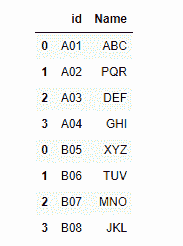

# 如何用 Python 组合两个数据框——熊猫？

> 原文:[https://www . geesforgeks . org/如何组合两个 python 中的数据框-pandas/](https://www.geeksforgeeks.org/how-to-combine-two-dataframe-in-python-pandas/)

**先决条件** : [熊猫](https://www.geeksforgeeks.org/pandas-tutorial/)

在许多现实生活中，我们想要使用的数据来自多个文件。我们经常需要将这些文件组合成一个单一的数据框架来分析数据。熊猫提供了这样的工具，在连接/合并类型操作的情况下，可以轻松地将 Series 或 DataFrame 与各种索引和关系代数功能的集合逻辑相结合。此外，熊猫还提供实用程序来比较两个系列或数据帧，并总结它们的差异。

## 连接数据帧

pandas 中的 concat()函数用于将一个数据帧中的列或行追加到另一个数据帧中。concat()函数执行沿一个轴执行串联操作的所有繁重工作，同时对其他轴上的索引(如果有)执行可选的集合逻辑(并集或交集)。

## 蟒蛇 3

```
import pandas as pd
# First DataFrame
df1 = pd.DataFrame({'id': ['A01', 'A02', 'A03', 'A04'],
                    'Name': ['ABC', 'PQR', 'DEF', 'GHI']})

# Second DataFrame
df2 = pd.DataFrame({'id': ['B05', 'B06', 'B07', 'B08'],
                    'Name': ['XYZ', 'TUV', 'MNO', 'JKL']})

frames = [df1, df2]

result = pd.concat(frames)
display(result)
```

**输出:**



## 正在加入数据框

当我们连接我们的数据帧时，我们简单地将它们相互添加，即垂直或并排堆叠它们。组合数据框的另一种方法是在每个数据集中使用包含公共值(公共唯一 id)的列。使用公共字段组合数据帧称为“连接”。包含公共值的列称为“连接键”。当一个数据帧是一个“查找表”，其中包含我们希望包含在另一个数据帧中的附加数据时，以这种方式连接数据帧通常很有用。

**注意:**这个连接表的过程类似于我们在 SQL 数据库中处理表的过程。

将多个数据框粘合在一起时，您可以选择如何处理其他轴(除了被连接的轴)。这可以通过以下两种方式实现:

*   把他们都联合起来，加入= '外部'。这是默认选项，因为它导致零信息丢失。
*   走十字路口，连接= '内部'。

**示例:**

## 蟒蛇 3

```
import pandas as pd

df1 = pd.DataFrame({'id': ['A01', 'A02', 'A03', 'A04'],
                    'Name': ['ABC', 'PQR', 'DEF', 'GHI']})

df3 = pd.DataFrame({'City': ['MUMBAI', 'PUNE', 'MUMBAI', 'DELHI'],
                    'Age': ['12', '13', '14', '12']})

# the default behaviour is join='outer'
# inner join

result = pd.concat([df1, df3], axis=1, join='inner')
display(result)
```