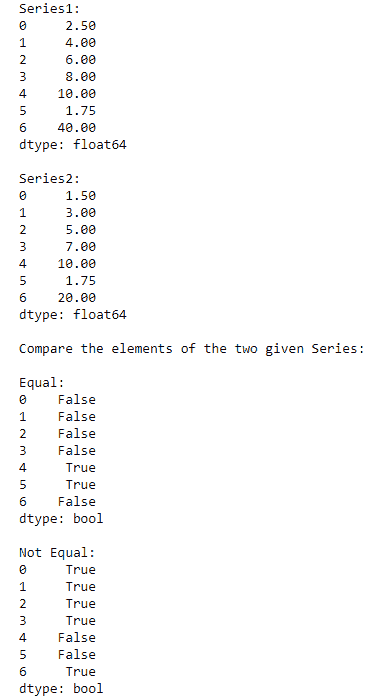
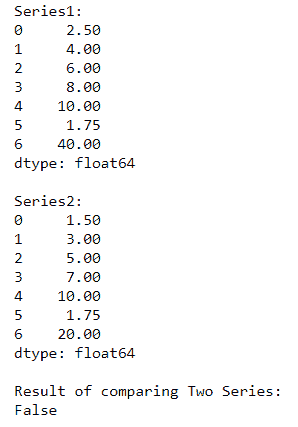
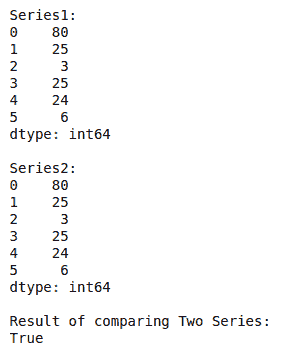

# 如何比较两个熊猫系列的元素？

> 原文:[https://www . geeksforgeeks . org/如何比较两只熊猫的元素系列/](https://www.geeksforgeeks.org/how-to-compare-the-elements-of-the-two-pandas-series/)

有时我们需要比较熊猫系列来进行一些比较分析。借助**关系运算符**可以比较两个熊猫系列，我们可以很容易地一次比较两个系列的对应元素。结果将以真或假的形式显示。我们也可以使用类似 [**熊猫系列的函数来比较两个熊猫系列。**](https://www.geeksforgeeks.org/python-pandas-series-equals/)

**方法 1:使用关系运算符**

**例 1:** 检查**两个系列元素**是否**相等**

## 蟒蛇 3

```
# Importing pandas library
import pandas as pd

# Creating 2 pandas Series
ps1 = pd.Series([2.5, 4, 6, 8, 10, 1.75, 40])
ps2 = pd.Series([1.5, 3, 5, 7, 10, 1.75, 20])

print("Series1:")
print(ps1)
print("\nSeries2:")
print(ps2)

# Compare the series using '==' and '!=' 
# Relational operators
print("\nCompare the elements of the two given Series:")
print("\nEqual:")
print(ps1 == ps2)
print("\nNot Equal:")
print(ps1 != ps2)
```

**输出:**



在上面的例子中，我们比较了两个系列“ **ps1** ”和“ **ps2** 的元素，以检查它们是否相等。

**示例 2:** 检查系列 1 元素是否**大于**系列 2

## 蟒蛇 3

```
# Importing pandas library
import pandas as pd

# Creating 2 pandas Series
ps1 = pd.Series([2.5, 4, 6, 8, 10, 1.75, 40])
ps2 = pd.Series([1.5, 3, 5, 7, 10, 1.75, 20])

print("Series1:")
print(ps1)
print("\nSeries2:")
print(ps2)

# Compare the series using '>' Relational operators
print("\nCompare the elements of the two given Series:")
print("\nGreater than:")
print(ps1 > ps2)
```

**输出:**


在上例中，我们比较了两个系列“ **ps1** ”和“ **ps2** 的元素，以检查 ps1 的元素是否大于 ps2 的元素。

**示例 3:** 检查系列 1 元素是否小于系列 2 的

## **蟒蛇 3**

```
# Importing pandas library
import pandas as pd

# Creating 2 pandas Series 
ps1 = pd.Series([2.5, 4, 6, 8, 10, 1.75, 40])
ps2 = pd.Series([1.5, 3, 5, 7, 10, 1.75, 20])

print("Series1:")
print(ps1)
print("\nSeries2:")
print(ps2)

# Compare the series using '<' Relational operators
print("\nCompare the elements of the two given Series:")
print("\nLess than:")
print(ps1 < ps2)
```

****输出:****

****

**在上面的例子中，我们比较了两个系列的元素“ **ps1** ”和“ **ps2** ”来检查 ps1 的元素是否少于 ps2 的元素。**

****方法二:使用** [**熊猫 Series.equals()**](https://www.geeksforgeeks.org/python-pandas-series-equals/) **功能****

**熊猫 **Series.equals()** 功能测试两个物体是否包含相同的元素。此功能允许将两个系列或数据帧相互比较，以查看它们是否具有相同的形状和元素。**

****语法:****

```
Series.equals(othe**r)** 
```

****示例:****

## **蟒蛇 3**

```
# Importing pandas library
import pandas as pd

# Creating 2 pandas Series
ps1 = pd.Series([2.5, 4, 6, 8, 10, 1.75, 40])
ps2 = pd.Series([1.5, 3, 5, 7, 10, 1.75, 20])

print("Series1:")
print(ps1)
print("\nSeries2:")
print(ps2)

# Comparing two series using Series.equals()
# function
print("\nResult of comparing Two Series:")
result = ps1.equals(other=ps2)
print(result)
```

****输出:****

****

**在上面的例子中，我们使用函数 Series.equals()比较了给定的两个熊猫系列'**PS1 '**和 **'ps2'** 。**

****例 2:****

## **蟒蛇 3**

```
# Importing pandas library
import pandas as pd

# Creating 2 pandas Series
ps1 = pd.Series([80, 25, 3, 25, 24, 6])
ps2 = pd.Series([80, 25, 3, 25, 24, 6])

print("Series1:")
print(ps1)
print("\nSeries2:")
print(ps2)

# Comparing two series using Series.equals()
# function
print("\nResult of comparing Two Series:")
result = ps1.equals(other=ps2)
print(result)
```

****输出:****

****