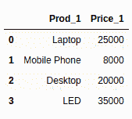
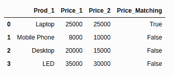

# 如何比较两个熊猫数据框中的值？

> 原文:[https://www . geesforgeks . org/如何比较两只熊猫的价值-数据框/](https://www.geeksforgeeks.org/how-to-compare-values-in-two-pandas-dataframes/)

让我们讨论如何比较熊猫数据框中的值。以下是比较两个熊猫数据帧中的值的步骤:

**步骤 1 数据框创建:**可以使用以下代码创建两个数据集的数据框:

```py
import pandas as pd

# elements of first dataset
first_Set = {'Prod_1': ['Laptop', 'Mobile Phone', 
                        'Desktop', 'LED'],
             'Price_1': [25000, 8000, 20000, 35000]
                   }

# creation of Dataframe 1
df1 = pd.DataFrame(first_Set, columns = ['Prod_1', 'Price_1'])
print(df1)

# elements of second dataset
second_Set = {'Prod_2': ['Laptop', 'Mobile Phone',
                         'Desktop', 'LED'],
              'Price_2': [25000, 10000, 15000, 30000]  
                    }

# creation of Dataframe 2
df2 = pd.DataFrame(second_Set, columns = ['Prod_2', 'Price_2'])
print (df2)
```

**输出:**




**第 2 步值的比较:**您需要导入 numpy 才能成功执行该步骤。以下是执行比较的通用模板:

> df1[“比较结果的新列”] = np.where(条件，“值为真”，“值为假”)

**示例:**执行此代码后，将在 df1 下形成名为 **Price_Matching** 的新列。将根据以下条件显示列结果:

*   如果价格 1 等于价格 2，则赋值为真
*   否则，请指定值“假”。

```py
# add the Price2 column from 
# df2 to df1
df1['Price_2'] = df2['Price_2'] 

# create new column in df1 to 
# check if prices match
df1['Price_Matching'] = np.where(df1['Price_1'] == df2['Price_2'],
                                 'True', 'False')  
df1
```

**输出:**

