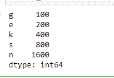
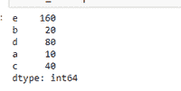
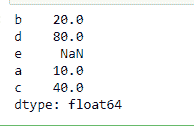

# 如何将字典转换成熊猫系列？

> 原文:[https://www . geesforgeks . org/如何将字典转换为熊猫系列/](https://www.geeksforgeeks.org/how-to-convert-a-dictionary-to-a-pandas-series/)

我们来讨论一下如何在 **Python** 中将一个 [**字典**](https://www.geeksforgeeks.org/python-dictionary/) 转换成 [**熊猫系列**](https://www.geeksforgeeks.org/python-pandas-series/) 。数列是一维标记数组，可以包含任何类型的数据，如整数、浮点、字符串、python 对象等。而 dictionary 是键:值对的无序集合。我们使用熊猫库的 **series()** 函数，通过传递字典作为参数，将字典转换为系列。

让我们看一些例子:

**示例 1:** 我们在 series()函数中传递字典的名称作为参数。输出的顺序与字典的顺序相同。

## 蟒蛇 3

```py
# Import pandas library
import pandas as pd

# Create a dictionary
d = {'g' : 100, 'e' : 200,
     'k' : 400, 's' : 800,
     'n' : 1600}

# Convert from dictionary to series
result_series = pd.Series(d)

# Print series
result_series
```

**输出:**



**例 2:** 我们传递字典的名称和不同的索引顺序。输出的顺序将与我们在参数中传递的顺序相同。

## 蟒蛇 3

```py
# Import pandas library
import pandas as pd

# Create a dictionary
d = {'a' : 10, 'b' : 20,
     'c' : 40, 'd' :80,
     'e' :160}

# Convert from dictionary to series
result_series = pd.Series(d, index = ['e', 'b',
                                      'd', 'a',
                                      'c'])
# Print series
result_series
```

**输出:**



**示例 3:** 在上面的示例中，索引列表的长度与字典中的键的数量相同。如果它们不相等会发生什么让我们借助一个例子来看看。

## 蟒蛇 3

```py
# Import pandas library
import pandas as pd

# Create a dictionary
d = {'a' : 10, 'b' : 20,
     'c' : 40, 'd':80}

# Convert from dictionary to series
result_series = pd.Series(d, index = ['b', 'd',
                                      'e', 'a',
                                      'c'])
# Print series
result_series
```

**输出:**



所以它给相应的索引赋值。