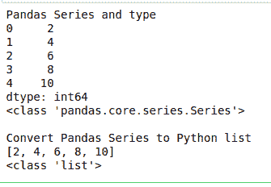
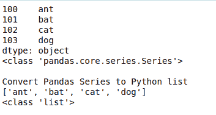
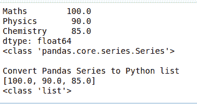
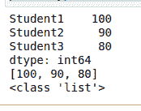

# 如何将一个熊猫系列转换成 Python 列表？

> 原文:[https://www . geesforgeks . org/如何将熊猫系列转换为 python 列表/](https://www.geeksforgeeks.org/how-to-convert-a-pandas-series-to-python-list/)

在本文中，我们将讨论如何将熊猫系列转换为 Python 列表及其类型。这可以使用 [tolist()](https://www.geeksforgeeks.org/python-pandas-series-tolist/) 方法来完成。
T3】例 1:

## 蟒蛇 3

```
import pandas as pd

evenNumbers = [2, 4, 6, 8, 10]

evenNumbersDs = pd.Series(evenNumbers)
print("Pandas Series and type")
print(evenNumbersDs)
print(type(evenNumbersDs))

print("\nConvert Pandas Series to Python list")
print(evenNumbersDs.tolist())
print(type(evenNumbersDs.tolist()))
```

**输出:**



在上面的例子中，我们将熊猫系列数据作为偶数传递。由于没有给出指标，默认 0 为 ****例 2:****

## **蟒蛇 3**

```
import pandas as pd
import numpy as np

data = np.array(['ant','bat','cat','dog'])
series = pd.Series(data,index=[100,101,102,103])
print(series)
print(type(series))

print("\nConvert Pandas Series to Python list")
print(series.tolist())
print(type(series.tolist()))
```

****输出:****

****

**在上面的例子中，我们将 Panda 系列数据作为 np.array 传递(['ant '，' bat '，' cat '，' dog'])。
指数为[100，101，102，103]**

****例 3:****

## **蟒蛇 3**

```
# Series from dictionary
import pandas as pd
import numpy as np

marks = {'Maths' : 100., 'Physics' : 90.,
         'Chemistry' : 85.}
series = pd.Series(marks)

print(series)
print(type(series))

print("\nConvert Pandas Series to Python list")
print(series.tolist())
print(type(series.tolist()))
```

****输出:****

****

****例 4:****

## **蟒蛇 3**

```
# Get First 3 student marks and
# convert as list
import pandas as pd
series = pd.Series([100, 90, 80, 90, 85],
                   index=['Student1', 'Student2',
                          'Student3', 'Student4',
                          'Student5'])

# retrieve the first three element
print(series[:3])
print(series[:3].tolist())
print(type(series[:3].tolist()))
```

****输出:****

****