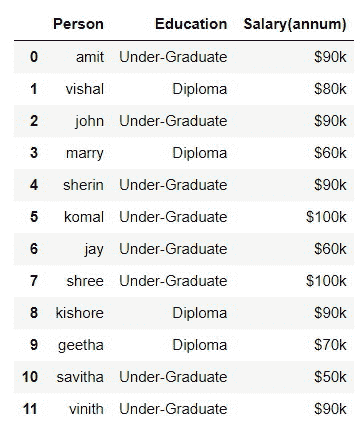
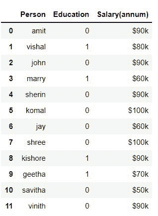
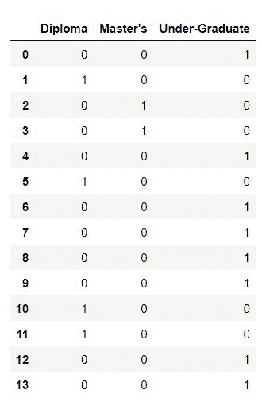
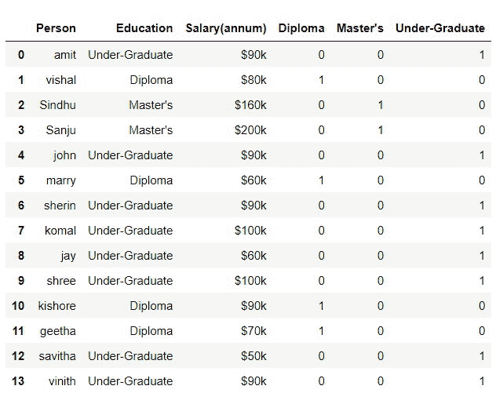
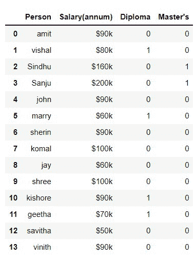

# 熊猫中分类变量如何转换为数值？

> 原文:[https://www . geesforgeks . org/如何将分类变量转换为熊猫数值/](https://www.geeksforgeeks.org/how-to-convert-categorical-variable-to-numeric-in-pandas/)

在本文中，我们将学习如何使用熊猫将分类变量转换为数值。

当我们查看分类数据时，任何人都会遇到的第一个问题是如何处理这些数据，因为机器学习总是擅长处理数值。我们可以通过使用文本数据来制作机器学习模型。因此，为了建立预测模型，我们必须将分类数据转换成数字形式。

## 方法 1:使用 replace()方法

替换是将分类术语转换为数字的方法之一。例如，我们将根据人们的教育水平获取一个工资数据集。这是分类变量的序数类型。我们将把他们的教育水平转换成数字。

> **语法:**
> 
> 替换(to _ replace =无，值=无，inplace =假，limit =无，regex =假，方法='pad ')

考虑给定的数据:



数据

## 蟒蛇 3

```
#import pandas
import pandas as pd

# read csv file
df = pd.read_csv('data.csv')

# replacing values
df['Education'].replace(['Under-Graduate', 'Diploma '],
                        [0, 1], inplace=True)
```

**输出:**



在上面的程序中，我们已经将“未毕业”替换为 0，将“文凭”替换为 1。

## **方法二:使用** [获得 _ 假人()](https://www.geeksforgeeks.org/python-pandas-get_dummies-method/)

替换这些值并不是转换它们的最有效方法。熊猫提供了一个名为 **get_dummies** 的方法，该方法将返回虚拟变量列。

> **语法:** pandas.get_dummies(数据，前缀=None，前缀 _sep='_ '，dummy_na=False，列=None，稀疏=False，drop_first=False，dtype=None)

### 逐步实施

**第一步:**创建假人立柱

调用 get_dummies()方法，并给出列的参数名。此方法将返回虚拟变量列。在这种情况下，我们有 3 种类型的分类变量，所以它返回三列



**步骤 2:** 连接

> **语法:** pandas.concat(objs，axis=0，join='outer '，ignore_index=False，keys = None，levels=None，names = None，verify_integrity=False，sort=False，copy=True

下一步是将假人列连接到数据帧中。在 pandas 中，有一个 [concat()](https://www.geeksforgeeks.org/pandas-concat-function-in-python/) 方法，可以调用它来连接两个数据帧。您应该为它提供两个数据框的名称和轴。这将为您提供合并的数据框。



**步骤 3:** 删除列

我们必须删除原来的“教育”列，因为我们有虚拟变量列，并且不需要文本列。我们也可以删除一个伪变量列，这样我们就可以避免伪变量陷阱，这可能会搞乱模型。删除列后，获得所需的数据框

我们将在代码中实现它

## 蟒蛇 3

```
#import pandas
import pandas as pd

# read csv
df = pd.read_csv('salary.csv')

# get the dummies and store it in a variable
dummies = pd.get_dummies(df.Education)

# Concatenate the dummies to original dataframe
merged = pd.concat([df, dummies], axis='columns')

# drop the values
merged.drop(['Education', 'Under-Graduate'], axis='columns')

# print the dataframe
print(merged)
```

**输出:**

