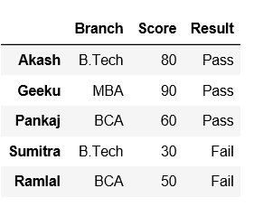
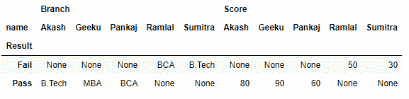

# 如何在 Python-Pandas 中将 Dataframe 列转换成索引？

> 原文:[https://www . geesforgeks . org/如何将数据框列转换为 python 索引-pandas/](https://www.geeksforgeeks.org/how-to-convert-dataframe-column-into-an-index-in-python-pandas/)

[**熊猫**](https://www.geeksforgeeks.org/introduction-to-pandas-in-python/) 提供了一种处理数据及其转换的便捷方式。让我们看看如何在 Pandas 中将数据框列转换为行名或索引。
首先用列表字典创建一个数据框架。

## 蟒蛇 3

```py
# importing pandas as pd
import pandas as pd

# Creating a dict of lists
data = {'Name':["Akash", "Geeku", "Pankaj", "Sumitra", "Ramlal"],
       'Branch':["B.Tech", "MBA", "BCA", "B.Tech", "BCA"],
       'Score':["80", "90", "60", "30", "50"],
       'Result': ["Pass", "Pass", "Pass", "Fail", "Fail"]}

# creating a dataframe
df = pd.DataFrame(data)

df
```

**输出:**


**方法#1:** 采用 [set_index()](https://www.geeksforgeeks.org/python-pandas-dataframe-set_index/) 方法。

## 蟒蛇 3

```py
# importing pandas as pd
import pandas as pd

# Creating a dict of lists
data = {'Name':["Akash", "Geeku", "Pankaj", "Sumitra", "Ramlal"],
       'Branch':["B.Tech", "MBA", "BCA", "B.Tech", "BCA"],
       'Score':["80", "90", "60", "30", "50"],
       'Result': ["Pass", "Pass", "Pass", "Fail", "Fail"]}

# Creating a dataframe
df = pd.DataFrame(data)

# Using set_index() method on 'Name' column
df = df.set_index('Name')

df
```

**输出:**


现在，将索引名称设置为无。

## 蟒蛇 3

```py
# set the index to 'None' via its name property
df.index.names = [None]

df
```

**输出:**



**法#2:** 用[枢()](https://www.geeksforgeeks.org/python-pandas-pivot/)法。
为了将数据框中的列转换为行名或索引，Pandas 内置了一个函数 Pivot。现在，假设我们希望结果是行/索引，列是数据框中的名称，为了实现这一点，pandas 提供了一个名为 Pivot 的方法。让我们看看它是如何工作的，

## 蟒蛇 3

```py
# importing pandas as pd
import pandas as pd

# Creating a dict of lists
data = {'name':["Akash", "Geeku", "Pankaj", "Sumitra", "Ramlal"],
       'Branch':["B.Tech", "MBA", "BCA", "B.Tech", "BCA"],
       'Score':["80", "90", "60", "30", "50"],
       'Result': ["Pass", "Pass", "Pass", "Fail", "Fail"]}

df = pd.DataFrame(data)

# pivoting the dataframe
df.pivot(index ='Result', columns ='name')

df
```

**输出:**

