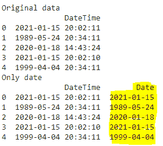
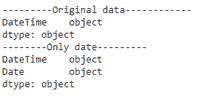
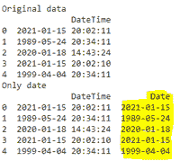

# 熊猫如何将日期时间转换为日期？

> 原文:[https://www . geesforgeks . org/如何将日期时间转换为熊猫中的日期/](https://www.geeksforgeeks.org/how-to-convert-datetime-to-date-in-pandas/)

日期时间是日期和时间的集合，格式为“yyyy-mm-dd HH:MM:SS”，其中 yyy-mm-dd 表示日期，HH:MM:SS 表示时间。

*   yyyy 代表年
*   mm 代表月
*   dd 代表日期
*   HH 代表小时
*   毫米代表分钟
*   SS 代表秒。

在本文中，我们将讨论在熊猫中将日期时间转换为日期。为此，我们将使用熊猫 Python 模块从日期时间中提取唯一的日期。

**语法:**

> 警局。数据帧(数据)

其中数据是输入的日期时间数据。

**示例:** Python 程序创建熊猫数据帧，包含 5 个日期时间值并显示

## 蟒蛇 3

```
# importing pandas module
import pandas as pd

# create pandas DataFrame with one column with five
# datetime values through a dictionary
df = pd.DataFrame({'DateTime': ['2021-01-15 20:02:11',
                                '1989-05-24 20:34:11',
                                '2020-01-18 14:43:24',
                                '2021-01-15 20:02:10',
                                '1999-04-04 20:34:11']})

# display
print(df)
```

**输出:**

> 日期时间
> 
> 0  2021-01-15 20:02:11
> 
> 1  1989-05-24 20:34:11
> 
> 2  2020-01-18 14:43:24
> 
> 3  2021-01-15 20:02:10
> 
> 4  1999-04-04 20:34:11

## **方法一:使用日期功能**

通过和熊猫一起使用日期方法，我们可以得到日期。

**语法:**

> data frame[' Date ']= PD . to _ DateTime(data frame[' DateTime ']. dt . Date

哪里，

*   数据帧是输入数据帧
*   to_datetime 是用于将日期时间字符串转换为日期时间的函数
*   日期时间是数据帧中的日期时间列
*   dt.date 用于将日期时间转换为日期
*   日期列是从日期时间中获取日期的新列

**示例:** Python 程序通过日期函数使用 pandas 将日期时间转换为日期

## 蟒蛇 3

```
# importing pandas module
import pandas as pd

# create pandas DataFrame with one column with five
# datetime values through a dictionary
df = pd.DataFrame({'DateTime': ['2021-01-15 20:02:11',
                                '1989-05-24 20:34:11',
                                '2020-01-18 14:43:24',
                                '2021-01-15 20:02:10',
                                '1999-04-04 20:34:11']})

print("Original data")
print(df)

# convert datetime column to just date
df['Date'] = pd.to_datetime(df['DateTime']).dt.date

# display
print("Only date")
print(df)
```

**输出:**



我们也可以通过使用数据类型来获取数据类型

**示例:**获取数据类型的 Python 程序

## 蟒蛇 3

```
# importing pandas module
import pandas as pd

# create pandas DataFrame with one column with five
# datetime values through a dictionary
df = pd.DataFrame({'DateTime': ['2021-01-15 20:02:11',
                                '1989-05-24 20:34:11',
                                '2020-01-18 14:43:24',
                                '2021-01-15 20:02:10',
                                '1999-04-04 20:34:11']})

print("---------Original data------------")
print(df.dtypes)

# convert datetime column to just date
df['Date'] = pd.to_datetime(df['DateTime']).dt.date

# display
print("--------Only date---------")
print(df.dtypes)
```

**输出:**



## **方法二:使用 normalize()方法**

我们也可以通过使用 normalize()方法得到，这个方法是用来通过从 DateTime 中提取日期来对数据进行规范化。我们正在使用 normalize()方法通过熊猫获取数据

**语法:**

> data frame[' Date ']= PD . to _ DateTime(data frame[' DateTime ']). dt . normalize()

哪里，

*   数据帧是输入数据帧
*   to_datetime 是用于将日期时间字符串转换为日期时间的函数
*   日期时间是数据帧中的日期时间列
*   dt.normalize()是用于将日期时间转换为日期的函数
*   日期列是从日期时间中获取日期的新列

**示例:**使用 pandas normalize()方法将日期时间转换为日期的 Python 代码。

## 蟒蛇 3

```
# importing pandas module
import pandas as pd

# create pandas DataFrame with one column with five
# datetime values through a dictionary
df = pd.DataFrame({'DateTime': ['2021-01-15 20:02:11',
                                '1989-05-24 20:34:11',
                                '2020-01-18 14:43:24',
                                '2021-01-15 20:02:10',
                                '1999-04-04 20:34:11']})

print("Original data")
print(df)

# convert datetime column to just date using normalize()
# method
df['Date'] = pd.to_datetime(df['DateTime']).dt.normalize()

# display
print("date extracted")
print(df)
```

**输出:**

