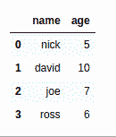

# 如何将字典转换成熊猫数据帧？

> 原文:[https://www . geesforgeks . org/如何将字典转换为熊猫-dataframe/](https://www.geeksforgeeks.org/how-to-convert-dictionary-to-pandas-dataframe/)

让我们讨论一下如何将 Python 字典转换成熊猫数据帧。我们可以用 **pd 把字典转换成熊猫的数据帧。DataFrame.from_dict()** 类方法。

**示例 1:** 将键值作为列表传递。

```
import pandas as pd

data = {'name': ['nick', 'david', 'joe', 'ross'],
        'age': ['5', '10', '7', '6']} 
new = pd.DataFrame.from_dict(data)

new
```

**Output:**

