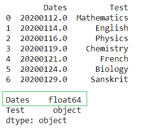
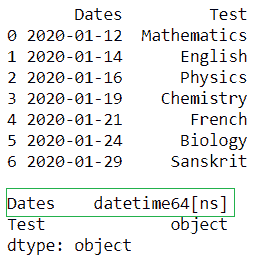
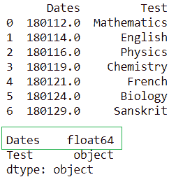
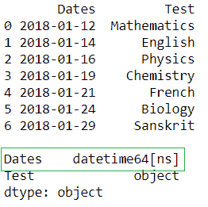
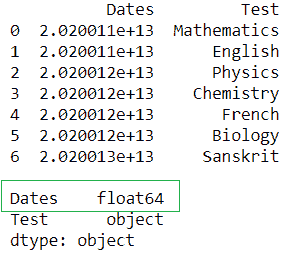
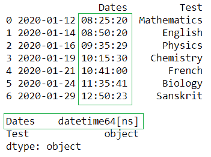

# 熊猫 DataFrame 中如何将 Float 转换为 Datetime？

> 原文:[https://www . geeksforgeeks . org/如何将浮点转换为熊猫中的日期时间-dataframe/](https://www.geeksforgeeks.org/how-to-convert-float-to-datetime-in-pandas-dataframe/)

Pandas Dataframe 提供了更改列值数据类型的自由。我们可以将它们从整数更改为浮点类型，从整数更改为日期时间，从字符串更改为整数，从浮点更改为日期时间等。为了将浮点转换为日期时间，我们使用[T1【pandas . to _ DateTime()](https://www.geeksforgeeks.org/python-pandas-to_datetime/)**函数**并遵循**语法**使用 **:**

> **语法:pandas.to_datetime** (arg，errors='raise '，dayfirst=False，yearfirst=False，utc=None，box=True，format=None，exact=True，unit=None，infer _ datetime _ format = False，origin='unix '，cache=False)

**示例 1:** 使用 **pandas.to_datetime()** 将一列从浮点转换为“**yyymmdd”**格式

## 蟒蛇 3

```
# importing pandas library
import pandas as pd

# Initializing the nested list 
# with Data set
player_list = [[20200112.0,'Mathematics'], 
               [20200114.0,'English'],
               [20200116.0,'Physics'], 
               [20200119.0,'Chemistry'],
               [20200121.0,'French'], 
               [20200124.0,'Biology'], 
               [20200129.0,'Sanskrit']]

# creating a pandas dataframe
df = pd.DataFrame(player_list,columns=['Dates','Test'])

# printing dataframe 
print(df)
print()

# checking the type 
print(df.dtypes)
```

**输出:**



更改数据类型后。

## 蟒蛇 3

```
# converting the float to datetime format 
df['Dates'] = pd.to_datetime(df['Dates'], format='%Y%m%d') 

# printing dataframe 
print(df)
print()

print(df.dtypes)
```

**输出:**



在上例中，我们将列“**date**”的数据类型从“ **float64** 更改为“**datetime 64【ns】**”类型。

**例 2:** 如果数据帧列是 **yymmdd** 格式，我们必须将其转换为**yymmdd**格式

## 蟒蛇 3

```
# importing pandas library
import pandas as pd

# Initializing the nested list with 
# Data set
player_list = [[180112.0,'Mathematics'],
               [180114.0,'English'],
               [180116.0,'Physics'],
               [180119.0,'Chemistry'],
               [180121.0,'French'],
               [180124.0,'Biology'],
               [180129.0,'Sanskrit']]

# creating a pandas dataframe
df = pd.DataFrame(player_list,columns=['Dates','Test'])

# printing dataframe 
print(df)
print()

# checking the type 
print(df.dtypes)
```

**输出:**



更改数据类型后。

## 蟒蛇 3

```
# converting the float to datetime format 
df['Dates'] = pd.to_datetime(df['Dates'], format='%y%m%d') 

# printing dataframe 
print(df)
print()

print(df.dtypes)
```

**输出:**



在上例中，我们将列“**date**”的数据类型从“ **float64** 更改为“**datetime 64【ns】**，格式从“ **yymmdd** 更改为“**yymmdd**”。

**示例 3:** 当我们必须将浮动列转换为**日期**和**时间**格式时

## 蟒蛇 3

```
# importing pandas library
import pandas as pd

# Initializing the nested list with Data set
player_list = [[20200112082520.0,'Mathematics'],
               [20200114085020.0,'English'],
               [20200116093529.0,'Physics'],
               [20200119101530.0,'Chemistry'],
               [20200121104060.0,'French'],
               [20200124113541.0,'Biology'],
               [20200129125023.0,'Sanskrit']]

# creating a pandas dataframe
df = pd.DataFrame(player_list,columns=['Dates','Test'])

# printing dataframe 
print(df)
print()

# checking the type 
print(df.dtypes)
```

**输出:**



更改数据类型后。

## 蟒蛇 3

```
# converting the float to datetime format 
df['Dates'] = pd.to_datetime(df['Dates'], format='%Y%m%d%H%M%S') 

# printing dataframe 
print(df)
print()

print(df.dtypes)
```

**输出:**



在上面的示例中，我们将列“**Date**”的数据类型从“ **float64** 更改为“**datetime 64【ns】**，并将格式更改为 **Date** 和 **Time**

**示例 4:** 使用 **pandas.to_datetime()** 将多个**列从 float 转换为**yyyymmdd**格式**

## 蟒蛇 3

```
# importing pandas library
import pandas as pd

# Initializing the nested list with Data set
player_list = [[20200112.0,'Mathematics',20200113.0],
               [20200114.0,'English',20200115.0],
               [20200116.0,'Physics',20200117.0],
               [20200119.0,'Chemistry',20200120.0],
               [20200121.0,'French',20200122.0],
               [20200124.0,'Biology',20200125.0],
               [20200129.0,'Sanskrit',20200130.0]]

# creating a pandas dataframe
df = pd.DataFrame(player_list,columns=['Starting_Date','Test','Ending_Date'])

# printing dataframe 
print(df)
print()

# checking the type 
print(df.dtypes)
```