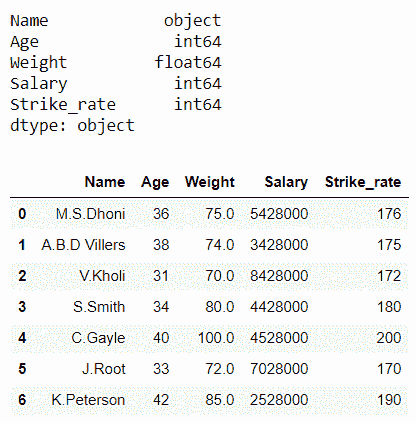
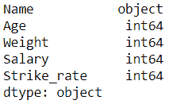
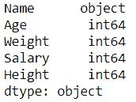
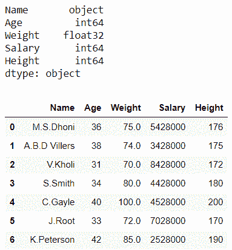
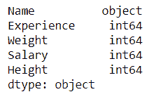
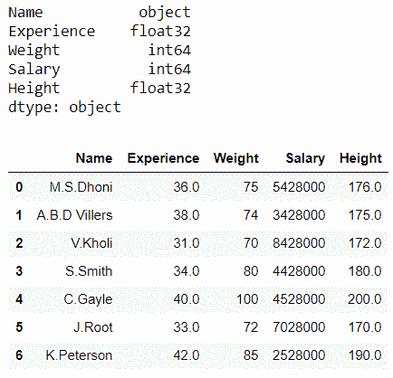

# 熊猫数据帧中如何将整数转换为浮点数？

> 原文:[https://www . geesforgeks . org/如何将整数转换为熊猫中的浮点数-dataframe/](https://www.geeksforgeeks.org/how-to-convert-integers-to-floats-in-pandas-dataframe/)

Pandas Dataframe 提供了更改列值数据类型的自由。我们可以将它们从整数改为浮点类型，从整数改为字符串，从字符串改为整数，等等。

有两种方法可以将整数转换为浮点数:

**方法 1:** 使用**数据框. astype()** 方法

**语法:**

```py
DataFrame.astype(dtype, copy=True, errors=’raise’, **kwargs)

```

**示例 1:** 使用**数据框. a type()**将**一个**列从 int 转换为 float

## 蟒蛇 3

```py
# importing pandas library
import pandas as pd

# Initializing the nested list with Data set
player_list = [['M.S.Dhoni', 36, 75, 5428000, 176], 
               ['A.B.D Villers', 38, 74, 3428000, 175], 
               ['V.Kholi', 31, 70, 8428000, 172],
               ['S.Smith', 34, 80, 4428000, 180], 
               ['C.Gayle', 40, 100, 4528000, 200],
               ['J.Root', 33, 72, 7028000, 170], 
               ['K.Peterson', 42, 85, 2528000, 190]]

# creating a pandas dataframe
df = pd.DataFrame(player_list, columns=[
                  'Name', 'Age', 'Weight', 'Salary', 'Strike_rate'])

# lets find out the data type 
# of 'Weight' column
print(df.dtypes)
```

**输出:**


让我们将重量类型转换为浮动

## 蟒蛇 3

```py
# Now we will convert it from 'int' to 'float' type 
# using DataFrame.astype() function
df['Weight'] = df['Weight'].astype(float)

print()

# lets find out the data type after changing
print(df.dtypes)

# print dataframe. 
df
```

**输出:**



在上例中，我们将列“**权重**”的数据类型从“int64”更改为“float64”。

**示例 2:** 使用 **DataFrame.astype()** 将多个**列从 int 转换为 float**

## 蟒蛇 3

```py
# importing pandas library
import pandas as pd

# Initializing the nested list with Data set
player_list = [['M.S.Dhoni', 36, 75, 5428000, 176], 
               ['A.B.D Villers', 38, 74, 3428000, 175],
               ['V.Kholi', 31, 70, 8428000, 172],
               ['S.Smith', 34, 80, 4428000, 180],
               ['C.Gayle', 40, 100, 4528000, 200],
               ['J.Root', 33, 72, 7028000, 170], 
               ['K.Peterson', 42, 85, 2528000, 190]]

# creating a pandas dataframe
df = pd.DataFrame(player_list, columns=[
                  'Name', 'Age', 'Weight', 'Salary', 'Strike_rate'])

# lets find out the data type of 'Age' 
# and 'Strike_rate' columns
print(df.dtypes)
```

**输出:**



让我们将年龄和罢工率转换为浮动类型

## 蟒蛇 3

```py
# now Pass a dictionary to astype() function  
# which contains two columns 
# and hence convert them from int to float type
df = df.astype({"Age":'float', "Strike_rate":'float'}) 
print()

# lets find out the data type after changing
print(df.dtypes)

# print dataframe. 
df 
```

**输出:**


在上例中，我们将列“ **Age** ”和“**Strike _ rate”**的数据类型从“int64”更改为“float64”。

**方法二:**使用**熊猫. to_numeric()** 方法

**语法**:

```py
pandas.to_numeric(arg, errors=’raise’, downcast=None)

```

**示例 1:** 使用 **pandas.to_numeric()** 将单个**列从 int 转换为 float**

## 蟒蛇 3

```py
# importing pandas library
import pandas as pd

# Initializing the nested list with Data set
player_list = [['M.S.Dhoni', 36, 75, 5428000, 176], 4
               ['A.B.D Villers', 38, 74, 3428000, 175], 
               ['V.Kholi', 31, 70, 8428000, 172],
               ['S.Smith', 34, 80, 4428000, 180], 
               ['C.Gayle', 40, 100, 4528000, 200],
               ['J.Root', 33, 72, 7028000, 170], 
               ['K.Peterson', 42, 85, 2528000, 190]]

# creating a pandas dataframe
df = pd.DataFrame(player_list, columns=[
                  'Name', 'Age', 'Weight', 'Salary', 'Height'])

# lets find out the data type of 
# 'Weight' column
print(df.dtypes)
```

**输出:**



让我们把重量从整数转换成浮点数

## 蟒蛇 3

```py
# Now we will convert it from 'int' to 'float' type
# using pandas.to_numeric()
df['Weight'] = pd.to_numeric(df['Weight'], downcast='float')
print()

# lets find out the data type after changing
print(df.dtypes)

# print dataframe. 
df 
```

**输出:**



在上例中，我们将列“**权重**”的数据类型从“int64”更改为“float32”。

**例 2:**

## 蟒蛇 3

```py
# importing pandas library
import pandas as pd

# Initializing the nested list with Data set
player_list = [['M.S.Dhoni', 36, 75, 5428000, 176], 
               ['A.B.D Villers', 38, 74, 3428000, 175], 
               ['V.Kholi', 31, 70, 8428000, 172],
               ['S.Smith', 34, 80, 4428000, 180], 
               ['C.Gayle', 40, 100, 4528000, 200],
               ['J.Root', 33, 72, 7028000, 170], 
               ['K.Peterson', 42, 85, 2528000, 190]]

# creating a pandas dataframe
df = pd.DataFrame(player_list, columns=[
                  'Name', 'Experience', 'Weight', 'Salary', 'Height'])

# lets find out the data type of 
# 'Experience' and 'Height' columns
print(df.dtypes)
```

**输出:**



让我们将经验和高度从 int 转换为 float

## 蟒蛇 3

```py
# Now we will convert them from 'int' to 'float' type
# using pandas.to_numeric()
df['Experience'] = pd.to_numeric(df['Experience'], downcast='float')
df['Height'] = pd.to_numeric(df['Height'], downcast='float')

print()

# lets find out the data type after changing
print(df.dtypes)

# print dataframe. 
df
```

**输出:**



在上面的示例中，我们将列“Experience”和“Height”的数据类型从“int64”更改为“float32”。