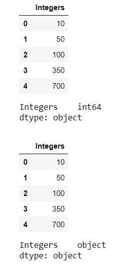
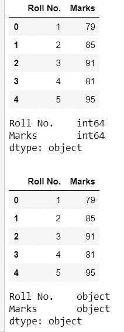

# 熊猫数据帧中如何将整数转换为字符串？

> 原文:[https://www . geesforgeks . org/如何将整数转换为字符串-in-pandas-dataframe/](https://www.geeksforgeeks.org/how-to-convert-integers-to-strings-in-pandas-dataframe/)

在本文中，我们将研究在熊猫数据帧中将**整数**转换为**字符串**的不同方法。在熊猫中，我们可以使用不同的功能来完成这项任务:

*   地图(字符串)
*   astype（s）
*   应用(字符串)
*   applymap(str)

**示例 1 :** 在本例中，我们将使用`**map(str)**`函数将一列整数的每个值转换为字符串。

```
# importing pandas as pd
import pandas as pd 

# creating a dictionary of integers
dict = {'Integers' : [10, 50, 100, 350, 700]}

# creating dataframe from dictionary
df = pd.DataFrame.from_dict(dict)
print(df)
print(df.dtypes)

print('\n')

# converting each value of column to a string
df['Integers'] = df['Integers'].map(str)
print(df)
print(df.dtypes)
```

**输出:**



我们可以在上面的输出中看到，在数据类型为`**int64**` 之前，转换为字符串之后，数据类型为`**object**` ，代表一个字符串。

**示例 2 :** 在本例中，我们将使用`**astype(str)**` 函数将一列整数的每个值转换为字符串。

```
# importing pandas as pd
import pandas as pd 

# creating a dictionary of integers
dict = {'Integers' : [10, 50, 100, 350, 700]}

# creating dataframe from dictionary
df = pd.DataFrame.from_dict(dict)
print(df)
print(df.dtypes)

print('\n')

# converting each value of column to a string
df['Integers'] = df['Integers'].astype(str)

print(df)
print(df.dtypes)
```

**输出:**


我们可以在上面的输出中看到，在数据类型为`**int64**` 之前，转换为字符串之后，数据类型为`**object**` ，代表一个字符串。

**示例 3 :** 在本例中，我们将使用`**apply(str)**`函数将一列整数的每个值转换为字符串。

```
# importing pandas as pd
import pandas as pd 

# creating a dictionary of integers
dict = {'Integers' : [10, 50, 100, 350, 700]}

# creating dataframe from dictionary
df = pd.DataFrame.from_dict(dict)
print(df)
print(df.dtypes)

print('\n')

# converting each value of column to a string
df['Integers'] = df['Integers'].apply(str)
print(df)
print(df.dtypes)
```

**输出:**


我们可以在上面的输出中看到，在数据类型为`**int64**` 之前，转换为字符串之后，数据类型为`**object**` ，代表一个字符串。

**示例 4 :** 我们上面看到的所有方法，都是将一个单独的列从整数转换成字符串。但是我们也可以使用 **`applymap(str)`** 方法将整个数据帧转换成字符串。

```
# importing pandas as pd
import pandas as pd 

# creating a dictionary of integers
dict = {'Roll No.' : [1, 2, 3, 4, 5], 'Marks':[79, 85, 91, 81, 95]}

# creating dataframe from dictionary
df = pd.DataFrame.from_dict(dict)
print(df)
print(df.dtypes)

print('\n')

# converting each value of column to a string
df = df.applymap(str)
print(df)
print(df.dtypes)
```

**输出:**



我们可以在上面的输出中看到，在数据类型为`**int64**` 之前，转换为字符串之后，数据类型为`**object**` ，代表一个字符串。