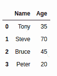

# 如何将熊猫数据框转换成列表？

> 原文:[https://www . geesforgeks . org/如何将熊猫-数据框转换为列表/](https://www.geeksforgeeks.org/how-to-convert-pandas-dataframe-into-a-list/)

让我们讨论如何将熊猫数据帧转换为列表。首先，让我们创建一个基本数据框架:

## 蟒蛇 3

```py
import pandas as pd 

# Creating a dictionary to store data
data = {'Name':['Tony', 'Steve', 'Bruce', 'Peter' ],
        'Age': [35, 70, 45, 20] } 

# Creating DataFrame 
df = pd.DataFrame(data) 

# Print the dataframe
df
```

**输出:**



有时，你可能需要把你的熊猫数据帧转换成列表。要完成此任务，可以使用“[**【to list()**](https://www.geeksforgeeks.org/python-pandas-series-tolist/)”功能。下面是一个使用此函数并将所需数据框转换为列表的基本示例。

## 蟒蛇 3

```py
df.values.tolist()
```