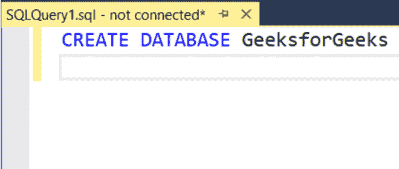
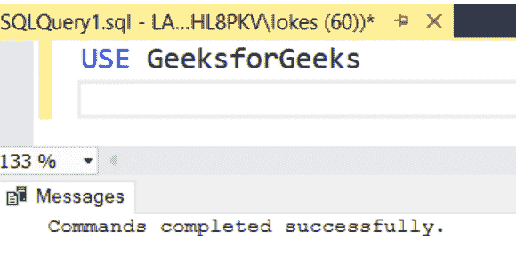
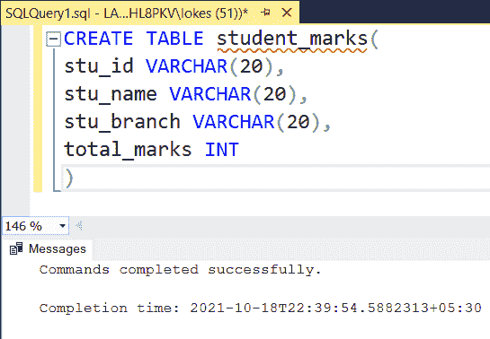
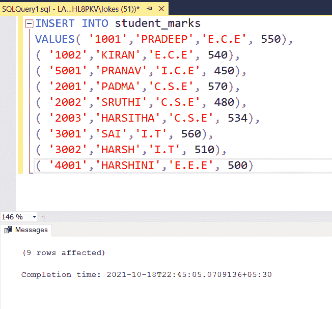
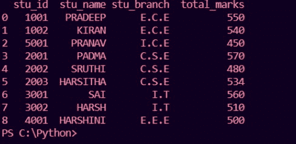

# 如何使用 pypyodbc 将 SQL 查询结果转换成熊猫数据帧？

> 原文:[https://www . geeksforgeeks . org/how-convert-SQL-query-result-to-pandas-data frame-using-pypypyodbc/](https://www.geeksforgeeks.org/how-to-convert-sql-query-results-to-pandas-dataframe-using-pypyodbc/)

在本文中，我们将看到如何使用 Python 中的 pypyodbc 模块将 SQL 查询结果转换为熊猫数据帧。

我们可能需要使用不同的查询从表中获得数据库结果来处理数据，并对数据应用任何机器学习来更好地分析事物和建议。我们可以将我们的数据转换成 python Pandas 数据帧，以对数据应用不同的机器算法。让我们看看如何使用微软 SQL 作为服务器将 SQL 查询结果发送到熊猫数据框架。

**pypypyodbc:**是纯 Python 跨平台 odbc 接口模块。在终端中使用此命令安装 pypyodbc 模块以访问 odbc 数据库。

```py
 pip install pypyodbc
```

## 创建数据库

### **步骤 1:创建数据库**

```py
CREATE DATABASE GeeksforGeeks;
```



### **第二步:使用数据库**

```py
USE GeeksForGeeks
```



### **第三步:创建表格 student_marks 并在表格中添加行**

```py
CREATE TABLE student_marks(
stu_id VARCHAR(20),
stu_name VARCHAR(20),
stu_branch VARCHAR(20),
total_marks INT
)
```

 

## 将 SQL 查询转换为熊猫数据帧

**例 1:**

使用 **pdb.connect()使用服务器名和数据库名连接到 MSSQL 服务器。**然后使用**读取 SQL 查询，读取 _sql()** 到熊猫数据框中并打印数据。

## 蟒蛇 3

```py
import pypyodbc as pdb 
import pandas as pd

connection = pdb.connect("""
    Driver={{SQL Server Native Client 11.0}};
    Server={0};
    Database={1};
    Trusted_Connection=yes;""".format('LAPTOP-LKHL8PKV',
                                      'GeeksForGeeks')
)

query = """SELECT * FROM student_marks"""
table = pd.read_sql(query, connection)
print(table)
```

**输出:**



**示例 2:** 查询获取从表到熊猫数据框的 E.C.E 分支的学生。

## 蟒蛇 3

```py
import pypyodbc as pdb 
import pandas as pd

connection = pdb.connect("""
    Driver={{SQL Server Native Client 11.0}};
    Server={0};
    Database={1};
    Trusted_Connection=yes;""".format('LAPTOP-LKHL8PKV',
                                      'GeeksForGeeks')
)

query = """SELECT * FROM student_marks
           WHERE stu_branch='E.C.E'"""
table = pd.read_sql(query, connection)
print(table)
```

**输出:**

