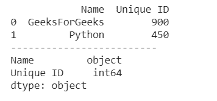
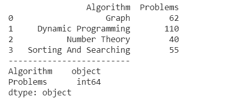

# 熊猫数据帧中字符串如何转换为整数？

> 原文:[https://www . geesforgeks . org/如何将字符串转换为熊猫中的整数-dataframe/](https://www.geeksforgeeks.org/how-to-convert-string-to-integer-in-pandas-dataframe/)

让我们看看熊猫数据帧中将字符串转换为整数的方法:

**方法 1:** 使用**系列. a 型()**方法。

> **语法:**series . a type(dtype，copy=True，errors='raise ')
> 
> **参数:**该方法将采用以下参数:
> 
> *   **数据类型:**要将序列转换成的数据类型。(例如字符串、浮点、整数)。
> *   **副本:**制作数据框/系列的[副本。](https://www.geeksforgeeks.org/python-difference-between-pandas-copy-and-copying-through-variables/)
> *   **错误:**转换到无效数据类型时引发错误。例如 dict to string。“引发”将引发错误,“忽略”将在不引发错误的情况下通过。
> 
> **返回:**数据类型发生变化的序列。

最有效的方法之一是熊猫型()。它用于修改一组数据类型。当数据框从 csv 文件创建时，列被导入，数据类型被自动配置，这几次都不是它应该有的。例如，工资列可以作为字符串导入，但是我们必须将它转换为 float 来执行操作。

**例 1:**

## 蟒蛇 3

```
# import pandas library
import pandas as pd

# dictionary
Data = {'Name': ['GeeksForGeeks','Python'],
          'Unique ID': ['900','450']}

# create a dataframe object
df = pd.DataFrame(Data)

# convert string to an integer
df['Unique ID'] = df['Unique ID'].astype(int)

# show the dataframe
print (df)
print("-"*25)

# show the data types
# of each columns
print (df.dtypes)
```

**输出:**



**例 2:**

## 蟒蛇 3

```
# import pandas library
import pandas as pd

# dictionary
Data = {'Algorithm': ['Graph', 'Dynamic Programming',
                      'Number Theory',
                      ' Sorting And Searching'],

          'Problems': ['62', '110', '40', '55']}

# create a dataframe object
df = pd.DataFrame(Data)

# convert string to integer
df['Problems'] = df['Problems'].astype(int)

# show the dataframe
print (df)
print("-"*25)

# show the data type
# of each columns
print (df.dtypes)
```

**输出:**



**方法二:**使用**熊猫**。**至 _ 数值**()法。

> **语法:** pandas.to_numeric(arg，错误='raise '，downcast=None)
> 
> **参数:**该方法将采用以下参数:
> 
> *   **参数:**列表、元组、一维数组或序列。
> *   **错误:** { '忽略'，'提高'，'要挟' }，默认为'提高'
>     **- >** 如果为'提高'，则无效解析将引发异常
>     **- >** 如果为'要挟'，则无效解析将设置为 NaN
>     **- >** 如果为'忽略'，则无效解析将返回输入
> *   **向下转换**:【默认无】如果不是无，并且如果数据已成功转换为数字数据类型，则根据以下规则将结果数据向下转换为可能的最小数字数据类型:
>     **- >** “整数”或“有符号”:最小有符号 int 数据类型(min。:np.int8)
>     **- >** “无符号”:最小的无符号 int dtype (min。:NP . uint 8)
>     **->**“float”:最小 float 数据类型(min。:np.float32)
> 
> **如果解析成功，返回:**数值。请注意，返回类型取决于输入。如果是系列，则为系列，否则为系列。

pandas.to numeric()是 pandas 中用于将参数转换为数字形式的广泛使用的方法之一。

**例 1:**

## 蟒蛇 3

```
# import pandas library
import pandas as pd

# dictionary
Data = {'Name': ['GeeksForGeeks','Python'],
          'Unique ID': ['900','450']}

# create a dataframe object
df = pd.DataFrame(Data)

# convert integer to string
df['Unique ID'] = pd.to_numeric(df['Unique ID'])

# show the dataframe
print (df)
print("-"*30)

# show the data type
# of each columns
print (df.dtypes)
```