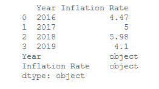
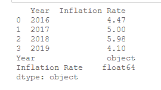
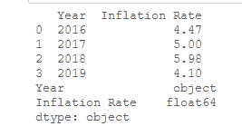
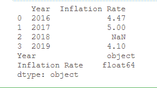

# 熊猫数据帧中如何将字符串转换为浮点数？

> 原文:[https://www . geesforgeks . org/如何将字符串转换为熊猫中的浮点数-dataframe/](https://www.geeksforgeeks.org/how-to-convert-strings-to-floats-in-pandas-dataframe/)

在这篇文章中，我们将研究在熊猫数据帧中将**字符串**转换为**浮动**的不同方法。现在，让我们创建一个以“年份”和“通货膨胀率”为列的数据框。

## 蟒蛇 3

```
# importing pandas library
import pandas as pd

# dictionary
Data = {'Year': ['2016', '2017', 
                 '2018', '2019'],
        'Inflation Rate': ['4.47', '5', 
                           '5.98', '4.1']}
# create a dataframe
df = pd.DataFrame(Data)

# show the dataframe
print (df)

# show the datatypes
print(df.dtypes)
```

**输出:**



**方法一:使用**[**data frame . astype()**](https://www.geeksforgeeks.org/python-pandas-dataframe-astype/)**。**

方法用于将 pandas 对象转换为指定的数据类型。

> **语法:**data frame . as type(self:~ FrameOrSeries，dtype，copy: bool = True，errors: str = 'raise')
> 
> **返回:**预测:呼叫者类型

**示例:**在本例中，我们将“通货膨胀率”列的每个值转换为浮动。

## 蟒蛇 3

```
# importing pandas library
import pandas as pd

# dictionary
Data = {'Year': ['2016', '2017', 
                 '2018', '2019'],
        'Inflation Rate': ['4.47', '5', 
                           '5.98', '4.1']}
# create a dataframe
df = pd.DataFrame(Data)

# converting each value 
# of column to a string
df['Inflation Rate'] = df['Inflation Rate'].astype(float)

# show the dataframe
print(df)

# show the datatypes
print (df.dtypes)
```

**输出:**



**方法二:使用**[**pandas . to _ numeric()**](https://www.geeksforgeeks.org/python-pandas-to_numeric-method/)**功能。**

函数用于将参数转换为数值类型。

> **语法:** pandas.to_numeric(arg，errors='raise '，downst = None)
> 
> **如果解析成功，返回:**数值。请注意，返回类型取决于输入。如果是系列，则为系列，否则为系列。

**示例 1:** 在本例中，我们将“通货膨胀率”列的每个值转换为浮动。

**代码:**

## 蟒蛇 3

```
# importing pandas library
import pandas as pd

# creating a dictionary
Data = {'Year': ['2016', '2017', 
                 '2018', '2019'],
          'Inflation Rate': ['4.47', '5', 
                             '5.98', '4.1']}
# create a dataframe
df = pd.DataFrame(Data)

# converting each value of column to a string
df['Inflation Rate'] = pd.to_numeric(df['Inflation Rate'])

# show the dataframe
print(df)

# show the data types
print (df.dtypes)
```

**输出:**



**示例 2:** 有时，我们可能没有用字符串表示的浮点值。因此，pd.to_numeric()函数将显示一个错误。要删除这个错误，我们可以使用 **errors= '要挟'**，将这个位置的值转换为 **NaN** 。

**代码**:

## 蟒蛇 3

```
# importing pandas as pd
import pandas as pd

# dictionary
Data = {'Year': ['2016', '2017',
                 '2018', '2019'],
         'Inflation Rate': ['4.47', '5', 
                           'No data', '4.1']}

# create a dataframe
df = pd.DataFrame(Data)

# converting each value of column to a string
df['Inflation Rate'] = pd.to_numeric(df['Inflation Rate'],
                                     errors = 'coerce')

# show the dataframe
print(df)

# show the data types
print (df.dtypes)
```

**输出:**



**注意:字符串数据类型显示为对象。**