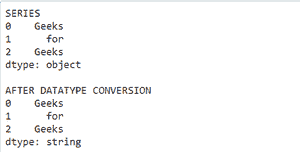
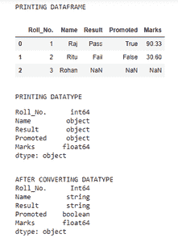
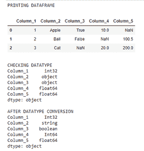

# 熊猫中如何自动转换成最佳数据类型？

> 原文:[https://www . geeksforgeeks . org/如何转换成最佳数据类型-自动输入熊猫/](https://www.geeksforgeeks.org/how-to-convert-to-best-data-types-automatically-in-pandas/)

**先决条件:**T2】熊猫

默认情况下，熊猫的数据类型是 int、float 和 objects。当我们在 pandas 中加载或创建任何系列或数据框时，pandas 默认情况下会为列和系列分配必要的数据类型。

我们将使用 pandas convert _ dtypes()函数自动将默认分配的数据类型转换为最佳数据类型。使用 convert _ dtypes()有一个很大的好处——它支持缺失值 pd 的新类型。NA 和 NaN 一起。熊猫 1.1.4 版本支持。

**语法:**

**对于系列:**

```py
series_name.convert_dtypes()
```

**对于数据帧:**

```py
dataframe_name.convert_dtypes().dtypes
```

下面是系列和数据帧的实现:

**转换序列的数据类型:**

*   导入模块
*   创建系列
*   现在使用 convert_dtypes()函数自动转换数据类型

**示例:**

## 蟒蛇 3

```py
# importing packages
import pandas as pd

# creating a series
s = pd.Series(['Geeks', 'for', 'Geeks'])

# printing the series
print("SERIES")
print(s)

print()

# using convert_dtypes() function
print("AFTER DATATYPE CONVERSION")
print(s.convert_dtypes())
```

**输出:**



**转换数据帧的数据类型:**

*   导入模块
*   创建数据框
*   检查数据类型
*   使用 convert _ dtypes()转换数据类型。数据类型功能

列的数据类型会相应更改。但是 dataframe 的数据类型仍然是 object，因为它包含多个列，每个列都有不同的数据类型。

**示例:**

## 蟒蛇 3

```py
import pandas as pd
import numpy as np

# creating a dataframe
df = pd.DataFrame({"Roll_No.": ([1, 2, 3]),
                   "Name": ["Raj", "Ritu", "Rohan"],
                   "Result": ["Pass", "Fail", np.nan],
                   "Promoted": [True, False, np.nan],
                   "Marks": [90.33, 30.6, np.nan]})

# printing the dataframe
print("PRINTING DATAFRAME")
display(df)

# checking datatype
print()
print("PRINTING DATATYPE")
print(df.dtypes)

# converting datatype
print()
print("AFTER CONVERTING DATATYPE")
print(df.convert_dtypes().dtypes)
```

**输出:**



**通过系列创建数据框并指定数据类型:**

*   导入模块
*   通过系列创建数据框，并指定数据类型
*   检查数据类型
*   使用 convert _ dtypes()进行转换。数据类型功能

**示例:**

## 蟒蛇 3

```py
import pandas as pd
import numpy as np

# Creating the Data frame through series
# and specifying datatype along with it
df = pd.DataFrame({"Column_1": pd.Series([1, 2, 3], dtype=np.dtype("int32")),
                   # Column_1 datatype is int32

                   "Column_2": pd.Series(["Apple", "Ball", "Cat"], 
                                         dtype=np.dtype("object")),
                   # Column_2 datatype is 0

                   "Column_3": pd.Series([True, False, np.nan], 
                                         dtype=np.dtype("object")),
                   # Column_3 datatype is 0

                   "Column_4": pd.Series([10, np.nan, 20], 
                                         dtype=np.dtype("float")),
                   # Column_4 datatype is float

                   "Column_5": pd.Series([np.nan, 100.5, 200],
                                         dtype=np.dtype("float"))})
                   # Column_5 datatype is float

# printing dataframe
print("PRINTING DATAFRAME")
display(df)

# checking datatype
print()
print("CHECKING DATATYPE")
print(df.dtypes)

# convert datatype
print()
print("AFTER DATATYPE CONVERSION")
print(df.convert_dtypes().dtypes)
```

**输出:**

