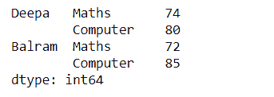
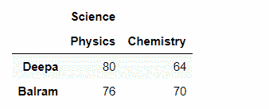

# 如何用 Pandas stack()将宽数据帧转换为整齐数据帧？

> 原文:[https://www . geeksforgeeks . org/如何将宽数据框转换为整齐数据框-带熊猫-stack/](https://www.geeksforgeeks.org/how-to-convert-wide-dataframe-to-tidy-dataframe-with-pandas-stack/)

我们有时可能需要整齐/长格式的数据来进行数据分析。因此，在 python 的库 Pandas 中，有几种方法可以将一个宽格式的数据框重塑为长/整齐格式的数据框。在这里，我们将讨论使用 pandas 函数堆栈()将数据从宽格式转换为长格式。stack()主要将指定的索引从列堆栈到索引形式。并且它返回一个重新整形的数据帧，或者甚至是一个具有多级索引的序列，与当前数据帧相比，该序列具有一个或多个新的最内层，这些层是通过旋转当前数据帧的列来创建的，并且输出:

*   **系列:**如果列只有一个级别
*   **数据框:**如果列有多个级别，则新的索引级别取自指定的级别。

> **语法:**数据帧堆栈(级别=- 1，dropna =真)
> 
> **参数–**
> 
> *   **级别:**从列轴到索引轴堆叠。它要么接受一个 int、string 或 list 作为输入值。默认情况下设置为-1。
> *   **dropna :** 它询问是否将行放入结果数据框或系列中，以防它们没有任何值。它属于布尔类型，默认情况下设置为真。
> 
> **返回**一个堆叠的数据帧或系列。

现在，让我们开始编码！

**案例 1#:**

首先，让我们从一个简单的单级列和一个广泛的数据形式开始。

## 蟒蛇 3

```
import pandas as pd

# Single level columns
df_single_level_cols = pd.DataFrame([[74, 80], [72, 85]],
                                    index=['Deepa', 'Balram'],
                                    columns=['Maths', 'Computer'])
print(df_single_level_cols)
```

**输出**


现在，在我们应用 stack()函数之后，我们将得到一个数据帧，它的单级列轴返回一个 Series:

## 蟒蛇 3

```
# Single level with stack()
df_single_level_cols.stack()
```

**输出:**



**案例 2#:**

现在我们用**多级列**来试试。

## 蟒蛇 3

```
# Simple Multi-level columns
multicol1 = pd.MultiIndex.from_tuples([('Science', 'Physics'),
                                       ('Science', 'Chemistry')])

df_multi_level_cols1 = pd.DataFrame([[80, 64], [76, 70]],
                                    index=['Deepa', 'Balram'],
                                    columns=multicol1)

print(df_multi_level_cols1)
```

**输出:**



用多级列轴堆叠数据框后:

## 蟒蛇 3

```
# Multi-level stacking with stack
df_multi_level_cols1.stack()
```