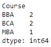
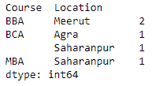

# 如何统计熊猫数据框中的重复？

> 原文:[https://www . geeksforgeeks . org/如何计数熊猫中的重复-数据框/](https://www.geeksforgeeks.org/how-to-count-duplicates-in-pandas-dataframe/)

让我们看看如何计算熊猫数据帧中的重复。我们的任务是统计单个列和多个列中重复条目的数量。

**单列下:**我们将使用 [`pivot_table()`](https://www.geeksforgeeks.org/python-pandas-pivot_table/) 功能统计单列中的重复项。要找到重复项的列将作为`index`参数的值传递。`aggfunc` 的价值将是“大小”。

```
# importing the module
import pandas as pd

# creating the DataFrame
df = pd.DataFrame({'Name' : ['Mukul', 'Rohan', 'Mayank', 
                             'Sundar', 'Aakash'],
                   'Course' : ['BCA', 'BBA', 'BCA', 'MBA', 'BBA'],
                   'Location' : ['Saharanpur', 'Meerut', 'Agra', 
                                 'Saharanpur', 'Meerut']})

# counting the duplicates
dups = df.pivot_table(index = ['Course'], aggfunc ='size')

# displaying the duplicate Series
print(dups)
```

**输出:**


**跨多列:**我们将使用 [`pivot_table()`](https://www.geeksforgeeks.org/python-pandas-pivot_table/) 功能统计跨多列的重复项。要找到重复项的列将作为列表作为`index`参数的值传递。`aggfunc` 的价值将是“大小”。

```
# importing the module
import pandas as pd

# creating the DataFrame
df = pd.DataFrame({'Name' : ['Mukul', 'Rohan', 'Mayank', 
                             'Sundar', 'Aakash'],
                   'Course' : ['BCA', 'BBA', 'BCA', 'MBA', 'BBA'],
                   'Location' : ['Saharanpur', 'Meerut', 'Agra', 
                                 'Saharanpur', 'Meerut']})

# counting the duplicates
dups = df.pivot_table(index = ['Course', 'Location'], aggfunc ='size')

# displaying the duplicate Series
print(dups)
```

**<u>输出</u>**

