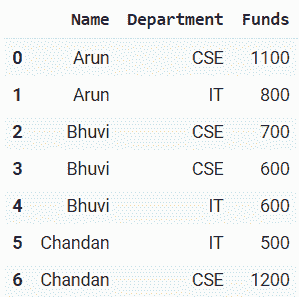
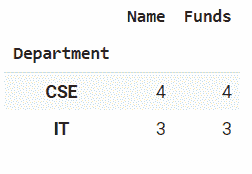
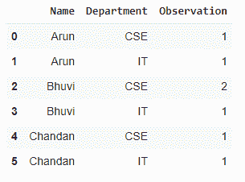

# 如何统计熊猫的分组观察？

> 原文:[https://www . geeksforgeeks . org/如何对熊猫进行分组观察/](https://www.geeksforgeeks.org/how-to-count-observations-by-group-in-pandas/)

在真正的数据科学项目中，您将处理大量数据并反复尝试，因此为了提高效率，我们使用 [Groupby](https://www.geeksforgeeks.org/pandas-groupby/) 概念。Groupby 概念非常重要，因为它能够高效地聚合数据，无论是性能还是代码量都非常出色。Groupby 主要指涉及以下一个或多个步骤的过程:

*   **拆分:**是我们通过对数据集应用一些条件，将数据拆分成组的过程。
*   **应用:**是我们对每组独立应用一个函数的过程。
*   **组合:**是我们将 groupby 和结果应用到一个数据结构中后，将不同数据集进行组合的过程。

> **语法:**group by(by =无，轴=0，级别=无，as _ index =真，排序=真，group _ keys =真，挤压=假，**kwargs)
> 
> **参数:**
> 
> *   **通过:**映射、函数、字符串或可迭代
> *   **轴:** int，默认 0
> *   **级别:**如果轴是多索引(分层)，则按特定级别分组
> *   **as_index :** 对于聚合输出，返回以组标签为索引的对象。仅与数据帧输入相关。as_index=False 实际上是“SQL 风格”的分组输出
> *   **排序:**排序组键。关闭此功能可以获得更好的性能。请注意，这不会影响各组内的观察顺序。groupby 保留每个组中的行顺序。
> *   **组合键:**调用 apply 时，将组合键添加到索引中以识别片段
> *   **挤压:**如果可能，减少返回类型的维度，否则返回一致的类型
> 
> **返回:**分组对象

这里，我们使用一个简单的虚拟数据帧，如下所示:



此外，我们使用一些方法来统计熊猫小组的观察结果，下面用例子来解释。

**示例 1:使用组计数(按一个变量计数)**

在本例中，我们将使用 group.count()方法来计算每个组中的成员总数。

## 蟒蛇 3

```py
# import libraries
import pandas as pd

#create pandas DataFrame
df = pd.DataFrame({'Name': ['Arun', 'Arun', 'Bhuvi', 'Bhuvi',
                            'Bhuvi', 'Chandan', 'Chandan'],

                   'Department':['CSE', 'IT', 'CSE', 'CSE',
                                 'IT', 'IT', 'CSE'],

                   'Funds': [1100, 800, 700, 600, 600, 500, 1200]})

# create a group using groupby
group = df.groupby("Department")

# count the observations
group.count()
```

**输出:**



**示例 2:使用组大小(按多个变量计数)**

在本例中，我们将使用 group.size()方法，该方法计算每个组中条目/行的数量。

## 蟒蛇 3

```py
# import libraries
import pandas as pd

#create pandas DataFrame
df = pd.DataFrame({'Name': ['Arun', 'Arun', 'Bhuvi', 'Bhuvi', 
                            'Bhuvi', 'Chandan', 'Chandan'],

                   'Department':['CSE', 'IT', 'CSE', 'CSE', 
                                 'IT', 'IT', 'CSE'],

                   'Funds': [1100, 800, 700, 600, 600, 500, 1200]})

# create a group using groupby
group = df.groupby(['Name', 'Department'])

# size of group to count observations
group = group.size()

# make a column name 
group.reset_index(name='Observation')
```

**输出:**

