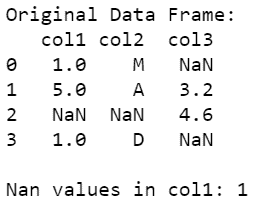
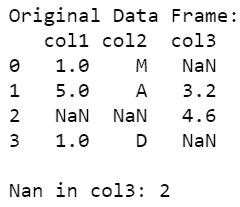

# 如何统计熊猫数据框中一列的 NaN 出现次数？

> 原文:[https://www . geeksforgeeks . org/如何计算熊猫栏中的 nan 出现次数-数据框/](https://www.geeksforgeeks.org/how-to-count-the-nan-occurrences-in-a-column-in-pandas-dataframe/)

数据帧被分成单元，这些单元可以存储属于某个数据结构的值，也可以包含缺失值或空值。*pands*包包含各种内置函数，用于检查数据帧单元中的值是否为 NA，并对这些 NA 值执行聚合。

**方法#1:** 在数据框上使用内置方法 [*isna()*](https://www.geeksforgeeks.org/python-pandas-dataframe-isna/) 和 [*sum()*](https://www.geeksforgeeks.org/python-pandas-dataframe-sum/) 。

*isna()* 函数用于检测缺失值/无值，并返回一个长度等于数据帧元素的布尔数组，而 *sum()* 方法用于计算这些缺失值的总和。

## 蟒蛇 3

```py
# importing necessary packages
import pandas as pd
import numpy as np

# creating data
data = [[1, "M", np.nan], [5, "A", 3.2], [
    np.nan, np.nan, 4.6], [1, "D", np.nan]]

# converting data to data frame
data_frame = pd.DataFrame(data, 
                          columns=["col1", "col2", "col3"])

# printing original data frame
print("\nOriginal Data Frame:")
print(data_frame)

# counting NaN values of col1
cnt = data_frame["col1"].isna().sum()

# printing count of NaN values
print("\nNan values in col1:", cnt)
```

**输出:**



**方法 2:** 使用数据帧的长度

从数据帧的长度(即数据帧中的行数)中减去数据帧的任何特定列中包含的值的计数。 *count()* 方法给出了指定列中 NaN 值的总数，length(dataframe)给出了数据帧的长度，即帧中的总行数。

## 蟒蛇 3

```py
# importing necessary packages
import pandas as pd
import numpy as np

# creating data
data = [[1, "M", np.nan], [5, "A", 3.2],
        [np.nan, np.nan, 4.6], [1, "D", np.nan]]

# converting data to data frame
data_frame = pd.DataFrame(data, columns=["col1", "col2", "col3"])

# printing original data frame
print("\nOriginal Data Frame:")
print(data_frame)

# counting NaN values of col1
length = len(data_frame)
count_in_col3 = data_frame['col3'].count()
cnt = length - count_in_col3

# printing count of NaN values
print("\nNan in col3:", cnt)
```

**输出:**

