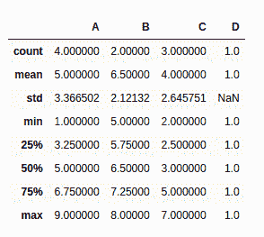

# 如何统计熊猫的 NaN 值数量？

> 原文:[https://www . geesforgeks . org/如何计算熊猫的 nan 值数量/](https://www.geeksforgeeks.org/how-to-count-the-number-of-nan-values-in-pandas/)

我们可能需要计算数据集中每个要素的 NaN 值的数量，以便决定如何处理它。例如，如果缺失值的数量很少，那么我们可以选择放弃那些观察值；或者可能有一列缺少大量条目，因此我们可以决定是否包含该变量。

**方法 1:使用 description()**

我们可以使用**description()**方法返回一个包含数据集详细信息的表。**计数**属性直接给出每列中非 NaN 值的计数。所以，如果我们知道观察的总数，我们可以得到 NaN 值的计数。

```py
import pandas as pd 
import numpy as np

# dictionary of lists 
dict = { 'A':[1, 4, 6, 9], 
        'B':[np.NaN, 5, 8, np.NaN], 
        'C':[7, 3, np.NaN, 2],
        'D':[1, np.NaN, np.NaN, np.NaN] } 

# creating dataframe from the
# dictionary 
data = pd.DataFrame(dict) 

data.describe()
```

**输出:**



**方法 2:使用 sum()**
*is null()*函数返回包含真值和假值的数据集。因为，真被视为 1，假被视为 0，所以调用 *isnull()* 系列上的 **sum()** 方法会返回真值的计数，该计数实际上对应于 NaN 值的数量。

**计算一列中的 NaN:**

我们可以简单地在所需的列中找到空值，然后得到总和。

```py
import pandas as pd
import numpy as np

# dictionary of lists 
dict = { 'A':[1, 4, 6, 9], 
        'B':[np.NaN, 5, 8, np.NaN], 
        'C':[7, 3, np.NaN, 2],
        'D':[1, np.NaN, np.NaN, np.NaN] } 

# creating dataframe from the
# dictionary 
data = pd.DataFrame(dict) 

# total NaN values in column 'B'
print(data['B'].isnull().sum())
```

**输出:**

```py
2
```

**连续数 NaN:**

可以使用 [loc](https://www.geeksforgeeks.org/python-pandas-extracting-rows-using-loc/) 或 [iloc](https://www.geeksforgeeks.org/python-extracting-rows-using-pandas-iloc/) 选择行。然后我们像以前一样求出总和。

```py
import pandas as pd 
import numpy as np

# dictionary of lists 
dict = { 'A':[1, 4, 6, 9],
        'B':[np.NaN, 5, 8, np.NaN], 
        'C':[7, 3, np.NaN, 2],
        'D':[1, np.NaN, np.NaN, np.NaN] }   

# creating dataframe from the 
# dictionary 
data = pd.DataFrame(dict) 

# total NaN values in row index 1
print(data.loc[1, :].isnull().sum())
```

**输出:**

```py
1
```

**计算整个数据框中的 NaN:**
要计算整个数据集中的 NaN，我们只需要调用 **sum()** 函数两次——一次用于获取每一列中的计数，另一次用于查找所有列的总和。

```py
import pandas as pd 
import numpy as np

# dictionary of lists 
dict = {'A':[1, 4, 6, 9],
        'B':[np.NaN, 5, 8, np.NaN],
        'C':[7, 3, np.NaN, 2],
        'D':[1, np.NaN, np.NaN, np.NaN]} 

# creating dataframe from the
# dictionary 
data = pd.DataFrame(dict) 

# total count of NaN values
print(data.isnull().sum().sum())
```

**输出:**

```py
6
```