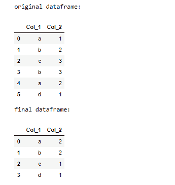
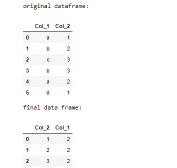

# 如何统计 Pandas Groupby 对象中的唯一值？

> 原文:[https://www . geesforgeks . org/如何计数-熊猫中的唯一值-groupby-object/](https://www.geeksforgeeks.org/how-to-count-unique-values-in-a-pandas-groupby-object/)

**先决条件:**T2】熊猫

顾名思义，Groupby 根据某些值的相似性对属性进行分组。我们可以使用 Groupby()，agg()，和 reset_index()方法计算 pandas Groupby 对象中的唯一值。本文描述了如何使用 pandas 检索数据框中某些属性的唯一值的计数。

### 使用的功能

*   [**group by()**](https://www.geeksforgeeks.org/python-pandas-dataframe-groupby/)**–**group by()函数用于根据一些标准将数据拆分成组。熊猫的物体可以在它们的任何一个轴上分开。

> ***语法:** DataFrame.groupby(by=None，axis=0，level=None，as_index=True，sort=True，group_keys=True，挤压=False，**kwargs)*
> 
> ***参数:***
> 
> *   ***通过:**映射、函数、字符串或可迭代*
> *   ***轴:** int，默认 0*
> *   ***级别:**如果轴是一个多索引(分层)，则按一个或多个特定级别分组*
> *   ***as_index :** 对于聚合输出，返回以组标签为索引的对象。仅与数据帧输入相关。as_index=False 实际上是“SQL 风格”的分组输出*
> *   ***排序:**排序组键。关闭此功能可以获得更好的性能。请注意，这不会影响各组内的观察顺序。groupby 保留每个组中的行顺序。*
> *   ***组合键:**调用 apply 时，将组合键添加到索引中以识别棋子*
> *   ***挤压:**如果可能的话减少返回类型的维度，否则返回一致类型*
> 
> ***返回:**分组对象*

*   [**【agg()】**](https://www.geeksforgeeks.org/python-pandas-series-agg/)**–**agg()用于传递一个函数或函数列表，以分别应用于一个系列甚至系列的每个元素。在函数列表的情况下，agg()方法会返回多个结果。

> ***语法:** DataFrame.aggregate(func，axis=0，*args，**kwargs)*
> 
> ***参数:***
> 
> *   ***功能:**可调用、字符串、字典或字符串/可调用列表。用于聚合数据的函数。如果是函数，则必须在传递数据帧或传递给数据帧时工作。应用。对于数据帧，如果键是数据帧列名，则可以传递字典。*
> *   ***轴:(默认 0)** {0 或‘索引’，1 或‘列’} 0 或‘索引】:对每列应用函数。1 或“列”:对每行应用函数。*
> 
> ***返回:*** *聚合数据帧*

*   [**【重置-索引()】**](https://www.geeksforgeeks.org/python-pandas-dataframe-reset_index/)**–**熊猫 reset_index()是一种重置数据帧索引的方法。reset_index()方法将从 0 到数据长度的整数列表设置为索引。

> ***语法:**data frame . reset _ index(level = None，drop=False，inplace=False，col_level=0，col _ fill =)*
> 
> ***参数:***
> 
> *   ***级别:** int、string 或列表，用于从索引中选择和移除传递的列。*
> *   ***删除:**布尔值，如果为假，则将替换的索引列添加到数据中。*
> *   ***替换:**布尔值，如果为真，则对原始数据框本身进行更改。*
> *   ***col_level:** 选择在哪个列级别插入标签。*
> *   ***col_fill:** Object，确定其他关卡的命名方式。*
> 
> ***返回类型:**数据框*

**进场:**

*   导入库
*   确定日期
*   分组日期
*   使用聚合函数
*   重置索引
*   打印数据

**例 1:**

## 计算机编程语言

```py
# import pandas
import pandas as pd

# create dataframe
df = pd.DataFrame({'Col_1': ['a', 'b', 'c', 'b', 'a', 'd'],
                   'Col_2': [1, 2, 3, 3, 2, 1]})

# print original dataframe
print("original dataframe:")
display(df)

# call groupby method.
df = df.groupby("Col_1")

# call agg method
df = df.agg({"Col_2": "nunique"})

# call reset_index method
df = df.reset_index()

# print dataframe
print("final dataframe:")
display(df)
```

**输出:**



**例 2:**

## 计算机编程语言

```py
# import pandas
import pandas as pd

# create dataframe
df = pd.DataFrame({'Col_1': ['a', 'b', 'c', 'b', 'a', 'd'],
                   'Col_2': [1, 2, 3, 3, 2, 1]})

# print original dataframe
print("original dataframe:")
display(df)

# call groupby method.
df = df.groupby("Col_2")

# call agg method
df = df.agg({"Col_1": "nunique"})

# call reset_index method
df = df.reset_index()

# print dataframe
print("final data frame:")
display(df)
```

**输出:**

