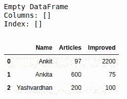
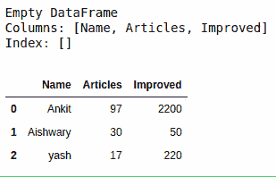
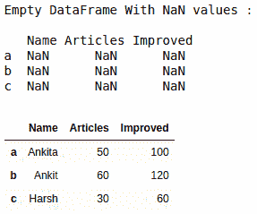

# 如何在 Pandas 中创建一个空的数据框并向其追加行&列？

> 原文:[https://www . geeksforgeeks . org/如何创建空数据框并在熊猫中添加行和列/](https://www.geeksforgeeks.org/how-to-create-an-empty-dataframe-and-append-rows-columns-to-it-in-pandas/)

让我们讨论如何创建一个空的数据框，并在 Pandas 中向其追加行和列。我们有多种方法可以完成这项任务。

**方法#1:** 创建一个没有任何列名或索引的完整的空数据框，然后将列一个接一个地追加到其中。

```
# import pandas library as pd
import pandas as pd

# create an Empty DataFrame object
df = pd.DataFrame()

print(df)

# append columns to an empty DataFrame
df['Name'] = ['Ankit', 'Ankita', 'Yashvardhan']
df['Articles'] = [97, 600, 200]
df['Improved'] = [2200, 75, 100]

df
```

**输出:**



**方法#2:** 创建一个只有列名的空数据框，然后使用 **`append()`** 方法将行一个接一个地附加到它上面。

```
# import pandas library as pd
import pandas as pd

# create an Empty DataFrame
# object With column names only
df = pd.DataFrame(columns = ['Name', 'Articles', 'Improved'])
print(df)

# append rows to an empty DataFrame
df = df.append({'Name' : 'Ankit', 'Articles' : 97, 'Improved' : 2200}, 
                ignore_index = True)
df = df.append({'Name' : 'Aishwary', 'Articles' : 30, 'Improved' : 50},
                ignore_index = True)
df = df.append({'Name' : 'yash', 'Articles' : 17, 'Improved' : 220},
               ignore_index = True)

df
```

**输出:**



**方法#3:** 用列名和索引创建一个空的数据框，然后使用 **`loc[]`** 方法将行一个接一个地追加到其中。

```
# import pandas library as pd
import pandas as pd

# create an Empty DataFrame object With
# column names and indices 
df = pd.DataFrame(columns = ['Name', 'Articles', 'Improved'], 
                   index = ['a', 'b', 'c'])

print("Empty DataFrame With NaN values : \n\n", df)

# adding rows to an empty 
# dataframe at existing index
df.loc['a'] = ['Ankita', 50, 100]
df.loc['b'] = ['Ankit', 60, 120]
df.loc['c'] = ['Harsh', 30, 60]

df
```

**输出:**

