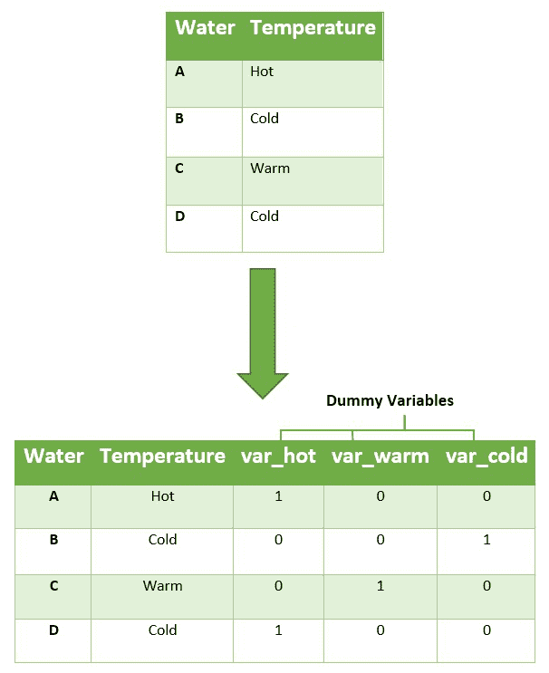
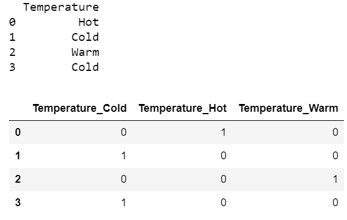
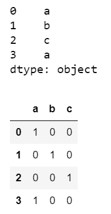
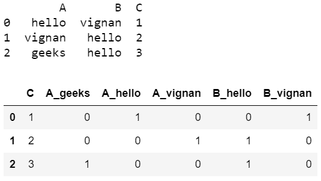

# 如何用熊猫在 Python 中创建虚拟变量？

> 原文:[https://www . geesforgeks . org/如何用 pandas 创建 python 中的虚拟变量/](https://www.geeksforgeeks.org/how-to-create-dummy-variables-in-python-with-pandas/)

数据集可能包含各种类型值，有时它由分类值组成。因此，为了有效地使用这些分类值进行编程，我们创建了虚拟变量。虚拟变量是一个二进制变量，它指示一个单独的分类变量是否具有特定的值。

**说明:**



如您所见，为温度属性的三个分类值创建了三个虚拟变量。我们可以使用 *get_dummies()* 方法在 python 中创建虚拟变量。

> **语法:** pandas.get_dummies(数据，前缀=None，前缀 _sep='_ '，)
> 
> **参数:**
> 
> *   数据=输入数据，即包括熊猫数据帧。名单。准备好。numpy 数组等。
> *   前缀=初始值
> *   prefix_sep=数据值分离。
> 
> **返回类型:**虚拟变量。

**分步方法:**

*   导入必要的模块
*   考虑数据
*   对数据执行操作以获得假人

**例 1:**

## 蟒蛇 3

```py
# import required modules
import pandas as pd
import numpy as np

# create dataset
df = pd.DataFrame({'Temperature': ['Hot', 'Cold', 'Warm', 'Cold'],
                   })

# display dataset
print(df)

# create dymmy variables
pd.get_dummies(df)
```

**输出:**



**例 2:**

考虑使用列表数组来获得假人

## 蟒蛇 3

```py
# import required modules
import pandas as pd
import numpy as np

# create dataset
s = pd.Series(list('abca'))

# display dataset
print(s)

# create dymmy variables
pd.get_dummies(s)
```

**输出:**



**例 3:**

这是另一个例子，获取虚拟变量。

## 蟒蛇 3

```py
# import required modules
import pandas as pd
import numpy as np

# create dataset
df = pd.DataFrame({'A': ['hello', 'vignan', 'geeks'],
                   'B': ['vignan', 'hello', 'hello'],
                   'C': [1, 2, 3]})

# display dataset
print(df)

# create dymmy variables
pd.get_dummies(df)
```

**输出:**

