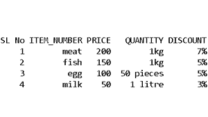

# 如何从嵌套的 XML 创建熊猫数据帧？

> 原文:[https://www . geesforgeks . org/how-create-pandas-data frame-from-nested-XML/](https://www.geeksforgeeks.org/how-to-create-pandas-dataframe-from-nested-xml/)

在本文中，我们将学习如何从嵌套的 XML 创建熊猫数据框架。我们将使用 **xml.etree.ElementTree** 模块，这是 Python 中的一个内置模块，用于解析或读取 xml 文件中的信息。元素树将 XML 文档表示为一棵树，元素只表示树中的一个节点。

### 使用的功能:

这里，我们将使用一些函数来处理下面陈述的代码:

*   **元素树。解析(XML_file) :** 从 XML 文件中读取数据
*   **root.iter('root_name'):** 遍历根节点的分支
*   **element tree . from string(XML _ file):**当 XML 代码在 python 代码中作为三引号内的字符串传递时读取数据
*   **查找解析后的 XML 元素树的所有元素**
*   **node . attribute . get(attribute te _ name):**获取属性
*   **node . find(attribute te _name):**检索所述属性 _ name 的文本内容
*   **熊猫。数据框():**将 XML 数据转换为数据框
*   [**列表追加()**](https://www.geeksforgeeks.org/python-perform-append-at-beginning-of-list/) **:** 将项目追加到列表中

### **接近**

*   使用 ElementTree.parse()函数解析或读取 XML 文件，并获取根元素。
*   迭代根节点以获得子节点属性‘SL NO’(这里)并提取每个属性的文本值(这里是 foodItem、价格、数量和折扣)。
*   将具有规格的各个食品作为一个单位附加到列表中(这里是 all_items()列表)。
*   使用熊猫将列表转换为数据帧。函数，并在用逗号分隔的引号中提及列名。
*   打印数据帧，就完成了。

#### 输入嵌套的 XML 数据

## 可扩展标记语言

```
<?xml version="1.0" encoding="UTF-8"?>

       <Food>

           <Info>
           <Msg>Food Store items.</Msg>
           </Info>

           <store slNo="1">
               <foodItem>meat</foodItem>
               <price>200</price>
               <quantity>1kg</quantity>
               <discount>7%</discount>
           </store>

           <store slNo="2">
               <foodItem>fish</foodItem>
               <price>150</price>
               <quantity>1kg</quantity>
               <discount>5%</discount>
           </store>

           <store slNo="3">
               <foodItem>egg</foodItem>
               <price>100</price>
               <quantity>50 pieces</quantity>
               <discount>5%</discount>
           </store>

           <store slNo="4">
               <foodItem>milk</foodItem>
               <price>50</price>
               <quantity>1 litre</quantity>
               <discount>3%</discount>
           </store>

       </Food>
```

**例 1:**

在下面的代码中，我们已经解析了 XML 文件。在引号中给出保存 XML 文件的完整路径。所以这里我们需要使用 ElementTree.parse()函数从 XML 文件中读取数据，然后使用 getroot()函数获取根。然后按照给定的步骤操作。

## 蟒蛇 3

```
import xml.etree.ElementTree as ETree
import pandas as pd

# give the path where you saved the xml file
# inside the quotes
xmldata = "C: \\ProgramData\\Microsoft\\
    Windows\\Start Menu\\Programs\\
    Anaconda3(64-bit)\\xmltopandas.xml"
prstree = ETree.parse(xmldata)
root = prstree.getroot()

# print(root)
store_items = []
all_items = []

for storeno in root.iter('store'):

    store_Nr = storeno.attrib.get('slNo')
    itemsF = storeno.find('foodItem').text
    price = storeno.find('price').text
    quan = storeno.find('quantity').text
    dis = storeno.find('discount').text

    store_items = [store_Nr, itemsF, price, quan, dis]
    all_items.append(store_items)

xmlToDf = pd.DataFrame(all_items, columns=[
  'SL No', 'ITEM_NUMBER', 'PRICE', 'QUANTITY', 'DISCOUNT'])

print(xmlToDf.to_string(index=False))
```

**输出:**



***注意***:XML 文件应该保存在你的 Python 代码保存的同一个目录或者文件夹中。

**例 2:**

我们还可以将 XML 内容作为字符串传递到三重引号中。在这种情况下，我们需要使用 fromstring()函数来读取字符串。使用“标记”对象获取根，并按照上面提到的相同步骤将其转换为数据帧。

## 蟒蛇 3

```
import xml.etree.ElementTree as ETree
import pandas as pd

xmldata = '''<?xml version="1.0" encoding="UTF-8"?>
        <Food>
            <Info>
            <Msg>Food Store items.</Msg>
            </Info>
            <store slNo="1">
                <foodItem>meat</foodItem>
                <price>200</price>
                <quantity>1kg</quantity>
                <discount>7%</discount>
            </store>
            <store slNo="2">
                <foodItem>fish</foodItem>
                <price>150</price>
                <quantity>1kg</quantity>
                <discount>5%</discount>
            </store>
            <store slNo="3">
                <foodItem>egg</foodItem>
                <price>100</price>
                <quantity>50 pieces</quantity>
                <discount>5%</discount>
            </store>
            <store slNo="4">
                <foodItem>milk</foodItem>
                <price>50</price>
                <quantity>1 litre</quantity>
                <discount>3%</discount>
            </store>
        </Food>
'''

prstree = ETree.fromstring(xmldata)
root = prstree.tag

#print(root)
store_items = []
all_items = []

for storeno in prstree.findall('store'):  
    store_Nr = storeno.attrib.get('slNo')
    itemsF= storeno.find('foodItem').text
    price= storeno.find('price').text
    quan= storeno.find('quantity').text
    dis= storeno.find('discount').text

    store_items = [store_Nr,itemsF,price,quan,dis]
    all_items.append(store_items)

xmlToDf = pd.DataFrame(all_items,columns=[
  'SL No','ITEM_NUMBER','PRICE','QUANTITY','DISCOUNT'])        

print(xmlToDf.to_string(index=False))
```

**输出:**

