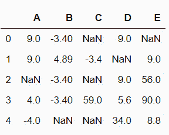
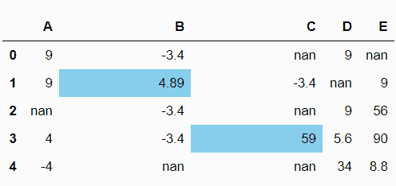
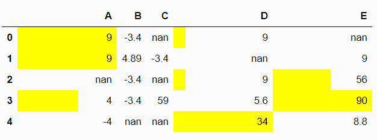

# 熊猫数据框中的条形图如何在指定的列上显示？

> 原文:[https://www . geesforgeks . org/如何显示熊猫条形图-指定列上的数据框/](https://www.geeksforgeeks.org/how-to-display-bar-charts-in-pandas-dataframe-on-specified-columns/)

在本文中，我们将看到如何在指定列的数据框中显示条形图。为了完成这个任务，我们使用熊猫数据框的**方法。**

> **语法:**熊猫。data frame . style . bar(columns _ list，颜色)
> 
> **返回:** *带有给定颜色条的数据框条上的正定值。在此过程中，将跳过无值和负值。*

现在，让我们创建一个数据框架:

## 蟒蛇 3

```
# importing required packages
import pandas
import numpy

Nan = numpy.nan

# creating a dataframe with some nan values
df = pandas.DataFrame(data = numpy.array(
                      [[9, -3.4, Nan, 9, Nan],
                       [9, 4.89, -3.4, Nan, 9],
                       [Nan, -3.4, Nan, 9, 56],
                       [4, -3.4, 59.0, 5.6, 90],
                       [-4, Nan, Nan, 34, 8.8]]),
                       columns = list("ABCDE"))

# view dataframe
df
```

**输出:**



**例 1:**

## 蟒蛇 3

```
# display the bar chart on dataframe
df.style.bar(subset = ['B', 'C'],
                   color = 'skyblue')
```

**输出:**



**例 2:**

## 蟒蛇 3

```
# display the bar chart on dataframe
df.style.bar(subset = ['A', 'D', 'E'],
                   color = 'yellow')
```

**输出:**

